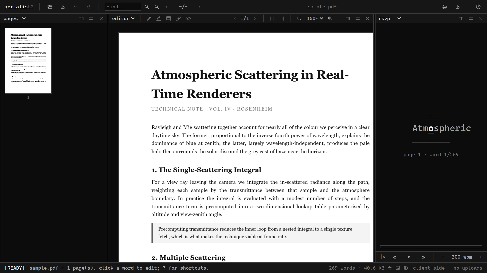

### The Project

This began as stubbornness. I could not accept that editing a sentence in a PDF —
a format whose entire premise is that it carries its own text and fonts — should
require either a subscription or uploading the document to a stranger's server.

Most browser-based PDF "editors" cheat: they place a text box on top of the page
and hope it lines up. **Aerialist2** doesn't. It parses the actual PDF content
stream — the text operators, the embedded fonts, the layout — exposes it through
a proper document model (Document → Page → Block → Line → Word → Glyph), and
rewrites the stream on export. The result is real PDF text: selectable,
searchable, and reflowing as though it had always been there.

Everything runs in the browser. No backend, no uploads, no accounts, and it keeps
working offline after the first load.

### Key Features

- **A Blender-style workspace** — the layout is a tree of resizable panes and each pane's function is switchable from its own header. Split, close, or reassign any of them; the layout persists across reloads.
- **editor** — click a word, line, table cell, or paragraph to edit in place. Auto mode picks the granularity: paragraphs reflow, tables edit per cell. AcroForm fields render as real fillable inputs positioned over the page.
- **redact** — drag over text and the glyph bytes are genuinely deleted from the content stream and barred out, not merely covered with a black rectangle.
- **sign** — a signature composer: draw freehand, type in a real embedded font, or import a photo of a signature and trace it over the reference image.
- **rsvp** — a speed-reading pane fed from the extracted word stream, with an ORP-style pivot display.
- **Chrome extension** — the identical app packaged as Manifest V3, replacing Chrome's built-in PDF viewer so any `.pdf` you navigate to opens here instead.

Beyond the panes: a **pages** grid for drag-to-reorder, multi-select,
duplicate/rotate/delete/extract/split, and merging by dropping another PDF onto a
position. Editor tools sit as toggles in the pane's own header — **fill** (click
anywhere and type; text lands in the content stream, and it is how you add text to
a page that has none), **comment**, **highlight** that snaps to detected lines,
and three size-reduction passes. Full undo/redo and keyboard shortcuts throughout.

The engine is entirely custom TypeScript — content stream lexer and parser, text
state interpreter, font/encoding/CMap decoding, word/line/block detection, layout
wrapping, and the content stream rewriter. No third-party PDF logic lives there at
all. PDF.js and pdf-lib are confined to rendering and document assembly, kept
behind the model so the UI never touches them directly. Pages are never rasterised
on export.

The aesthetic is deliberately minimal: monospace, greyscale, no colour accents,
terminal-style chrome. The document should be the only thing in the window with
any colour in it.

### An Honest Limitation

The Chrome extension redirects `.pdf`-suffixed URLs instantly. PDFs served without
a `.pdf` suffix — common for download endpoints — are caught by a `Content-Type`
check and redirected after a brief flash of the original viewer. That flash cannot
be removed. A third-party extension cannot register as a true OS-level MIME
handler the way Chrome's own bundled viewer does, and I would rather name the
asymmetry than paper over it. Local `file://` PDFs also need one manual permission
grant, because Chrome never lets an extension self-grant file access.

I find this genuinely instructive as a case study: the incumbent viewer is not
better than the alternative here, it is *privileged* over it, and the privilege
lives at a layer no amount of good engineering can reach.

### Live Experiment

    <a href="https://cyberhirsch.github.io/aerialist2/" class="inline-flex items-center px-8 py-4 text-lg font-bold text-white transition-all bg-primary-600 rounded-lg hover:bg-primary-500 hover:scale-105 shadow-xl shadow-primary-900/20">
        Launch Aerialist2 &nbsp; &rarr;
    </a>

[Get the Chrome extension &rarr;](https://chromewebstore.google.com/detail/eolpdeagjjcofgdnpjoohmolfpchggbo)

[View source on GitHub &rarr;](https://github.com/cyberhirsch/aerialist2)
