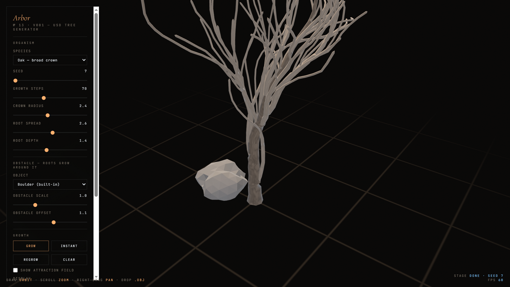

### The Experiment

Most procedural tree generators are grammars: an L-system expands a set of
rewriting rules and a tree falls out. The results are convincing until the tree
has to acknowledge anything around it, at which point a grammar has nothing to
say — it was never told there was a rock there.

**Arbor** uses **space colonisation** instead. Attraction points are scattered
through the volume the plant may occupy; branches grow toward whichever points
they can reach, and consume them on arrival. Growth is therefore driven by
available space rather than by a rule, which means an obstacle is handled
automatically: remove the attraction points inside a boulder and the roots simply
never grow there — they thicken around it, exactly as real roots do.

Crown and root systems run the same algorithm against different fields, so the
model is developmental rather than decorative — the silhouette is a consequence of
the space the organism was given.

### Into the Pipeline

The skeleton is meshed as swept strand-cylinders and exported to **USD**
(`.usda` / `.usdz`) with textures attached. That choice is the practical point of
the experiment: USD is the interchange format of contemporary 3D production, so a
tree grown in a browser tab around a boulder from a production scene can go
straight into that scene — or onto an iPhone, since `.usdz` is what AR Quick Look
consumes.

Drop your own `.obj` in to use it as the obstacle.

### Live Experiment

    <a href="https://cyberhirsch.github.io/Experiments/13_Arbor/Arbor_v001.html" class="inline-flex items-center px-8 py-4 text-lg font-bold text-white transition-all bg-primary-600 rounded-lg hover:bg-primary-500 hover:scale-105 shadow-xl shadow-primary-900/20">
        Launch Arbor &nbsp; &rarr;
    </a>

*(Requires WebGL2. Best experienced on desktop.)*

[View the Experiments collection &rarr;](https://github.com/cyberhirsch/Experiments)
