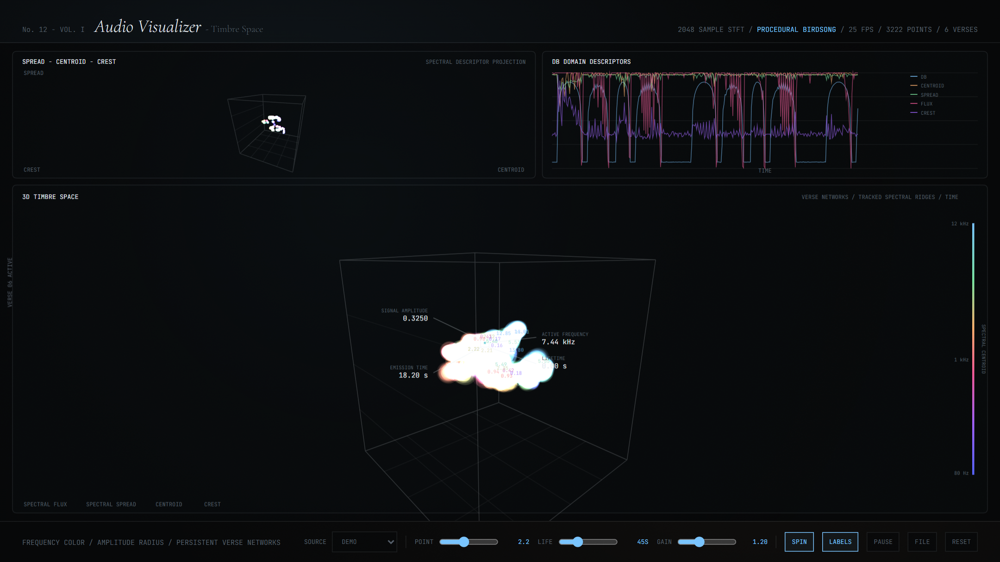

### The Experiment

Every bar-graph spectrum analyser performs the same quiet act of vandalism: the
FFT produces a **complex** number per frequency bin, carrying both magnitude and
phase, and the display keeps the magnitude and discards the phase. Half the
information is gone before anything is drawn.

**Audio Spiral** keeps it. Frequency runs along one axis; each bin's magnitude
becomes a radius and its phase becomes an angle, so the spectrum traces a
complex-valued spiral through space that twists as successive STFT frames arrive.

### Reading It

Phase is not decoration here. Because phase advances at a rate set by how far a
partial's true frequency sits from its bin centre, a steady tone traces a smooth,
regular helix while a noisy or rapidly-modulated one tumbles. Transients — where
phase across all bins momentarily aligns — appear as a sharp coherent twist that
a magnitude-only display renders as an undifferentiated wall.

Alongside the spiral, the standard spectral descriptors are tracked over time —
centroid, spread, flux, crest — which is the vocabulary timbre research actually
uses, and which turns a pretty picture into something legible.

The screenshot shows the built-in procedural birdsong demo: six verses, 2048-sample
STFT, spectral ridges tracked and persisted across frames so the structure of the
phrase accumulates rather than flickering past. Your own audio file can be dropped
in to replace it.

### Live Experiment

    <a href="https://cyberhirsch.github.io/Experiments/12_Audio%20Visualizer/AudioViz_v001.html" class="inline-flex items-center px-8 py-4 text-lg font-bold text-white transition-all bg-primary-600 rounded-lg hover:bg-primary-500 hover:scale-105 shadow-xl shadow-primary-900/20">
        Launch Audio Spiral &nbsp; &rarr;
    </a>

*(Requires WebGL2. Best experienced on desktop.)*

[View the Experiments collection &rarr;](https://github.com/cyberhirsch/Experiments)
