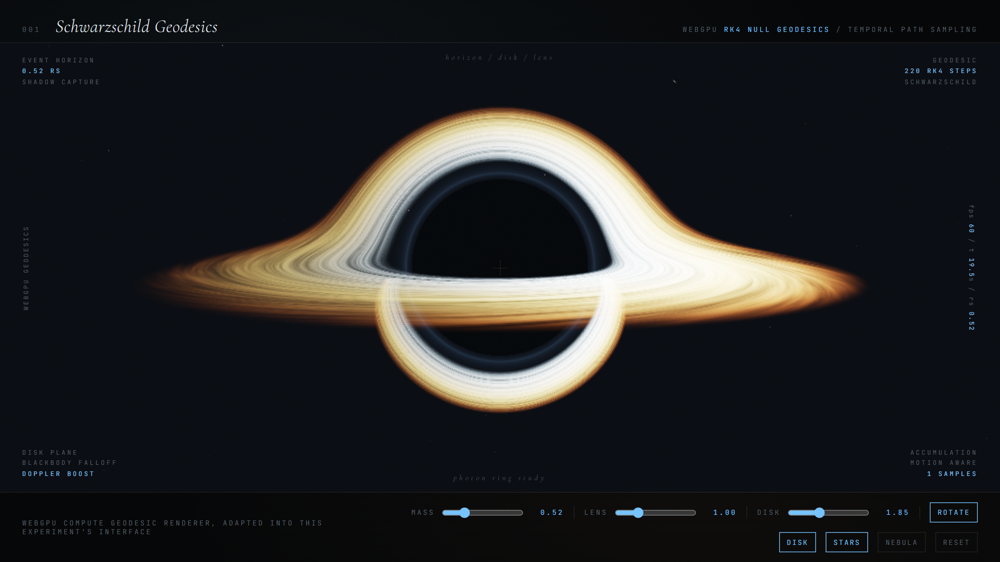

### The Experiment

Every conventional renderer assumes light travels in straight lines. Near a black
hole that assumption fails, and the failure *is* the image: the accretion disk
behind the hole is bent up and over the top into view, the disk in front is bent
under, and the two join into the halo that has no counterpart in flat-space
optics.

**Black Hole** drops the straight-line assumption. Rather than intersecting rays
with geometry, each ray is **numerically integrated as a geodesic** through
curved spacetime, stepping along the path a photon would actually take.

### What Falls Out of It

Nothing in this scene is an artistic effect layered on afterwards — each feature
is a consequence of the integration:

- **Gravitational lensing** of the disk and the background starfield, including the photon ring where paths orbit the hole before escaping.
- **The shadow** — not a black sphere drawn at the horizon, but the set of directions whose geodesics terminate at the singularity instead of reaching infinity.
- **Relativistic beaming**, which is why one side of the disk is conspicuously brighter: material approaching the viewer is Doppler-boosted, material receding is dimmed.

The cost is that every pixel requires an ODE integration rather than a ray-object
intersection, which is precisely the kind of embarrassingly parallel, arithmetic-heavy
workload a GPU is built for.

### Live Experiment

    <a href="https://cyberhirsch.github.io/Experiments/04_Black%20Hole/Black%20Hole_v001.html" class="inline-flex items-center px-8 py-4 text-lg font-bold text-white transition-all bg-primary-600 rounded-lg hover:bg-primary-500 hover:scale-105 shadow-xl shadow-primary-900/20">
        Launch Black Hole &nbsp; &rarr;
    </a>

*(Requires WebGL2 / WebGPU. Best experienced on desktop.)*

[View the Experiments collection &rarr;](https://github.com/cyberhirsch/Experiments)
