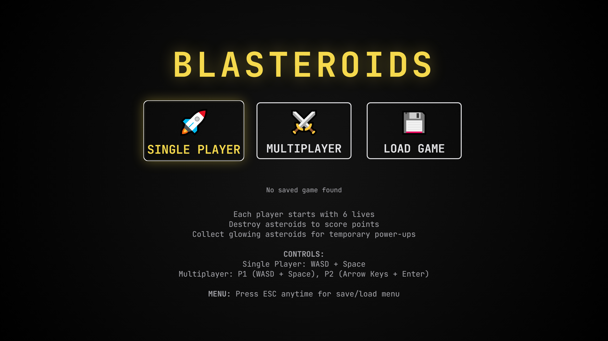

### The Project

**Blasteroids** is *Asteroids* with a second ship on the same keyboard. Each player
starts with six lives; destroying asteroids scores points, and the glowing ones
drop temporary boost power-ups worth diverting for.

WASD and space for player one, arrow keys and enter for player two. Six save slots
let a run be parked and resumed later, and the pause menu is one keypress away at
any point.

### The Constraint Is the Design

The shared keyboard is not a shortcut taken because networking was hard. It is the
premise.

Networked multiplayer changes what a game *is*. When your opponent is elsewhere,
the channel is the screen and everything social has to be reconstructed inside it —
chat, emotes, voice, ranking. When your opponent is next to you on a sofa, none of
that is needed, and a set of things become available that no amount of engineering
recovers: the elbow, the laughing, the accusation of cheating that is settled by
looking sideways.

I find local multiplayer a useful thing to make students build, because it forces
a distinction that is easy to state and hard to feel — between the game and the
situation the game creates. Two ships on one keyboard produces a specific
situation. It is not a lesser version of matchmaking; it is a different object.

Vanilla JavaScript, no framework.

    <a href="https://cyberhirsch.github.io/Blasteroids/" class="inline-flex items-center px-8 py-4 text-lg font-bold text-white transition-all bg-primary-600 rounded-lg hover:bg-primary-500 hover:scale-105 shadow-xl shadow-primary-900/20">
        Play Blasteroids &nbsp; &rarr;
    </a>

[View source on GitHub &rarr;](https://github.com/cyberhirsch/Blasteroids)
