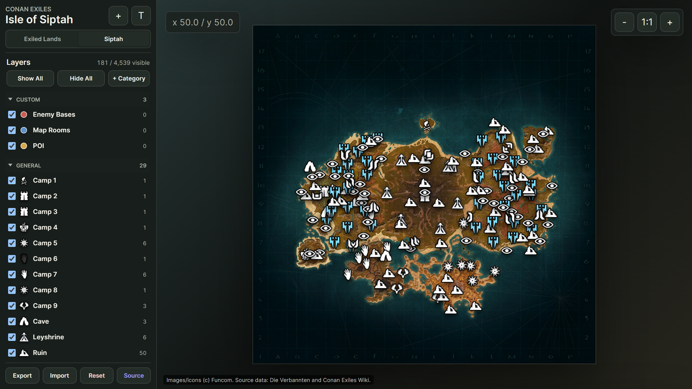

### The Project

An interactive progress and notes tracker for both *Conan Exiles* maps. The synced
local datasets hold **4,664 markers for the Exiled Lands** (from MapVault) and
**4,539 for the Isle of Siptah** (from Die Verbannten and the Conan Exiles Wiki).
Each map keeps its own progress, notes, layer visibility, custom categories and
custom markers, entirely in the browser.

Markers cover discovery locations (bosses, chests, lore, recipes, emotes, caves,
vistas), named and unnamed thralls by profession, resource nodes down to individual
silver and star metal deposits, tameable pets, and harvestable plants. A compact
layer panel gives every source and custom category its own checkbox, with Show All
/ Hide All and collapsible sections whose state is remembered per map. Marker icons
and labels hold a constant screen size as you zoom, which is the sort of detail
that goes unnoticed when it works and makes a map unusable when it does not.

Right-click anywhere to place a custom marker; right-click a custom marker to add
another or delete it. Synced source markers are protected from deletion, so your
annotations and the imported dataset cannot be confused with one another.

### Why Build It Locally

There are perfectly good online map sites for this game. I built my own anyway,
for one reason: **progress state is personal data**.

What I have visited, cleared, harvested and annotated is a record of how I spend my
evenings. It is not sensitive in any dramatic sense, and that is rather the point —
the reflex to hand a behavioural log to a third party because the interface was
convenient is worth resisting on small things precisely so that it stays available
as a reflex on large ones.

So everything lives in the browser. **Export** writes your notes, progress, custom
categories, markers and layer visibility to a JSON file you hold; **Import**
restores it; **Reset** clears it. A sync script refreshes the map tiles, marker
datasets and icons from the upstream sources when they change.

It runs by opening `index.html` — no server required.

    <a href="https://cyberhirsch.github.io/ConanExilesMap/" class="inline-flex items-center px-8 py-4 text-lg font-bold text-white transition-all bg-primary-600 rounded-lg hover:bg-primary-500 hover:scale-105 shadow-xl shadow-primary-900/20">
        Open the Tracker &nbsp; &rarr;
    </a>

[View source on GitHub &rarr;](https://github.com/cyberhirsch/ConanExilesMap)

*Marker data from MapVault, Die Verbannten and the Conan Exiles Wiki. Game images
and icons are credited to Funcom.*
