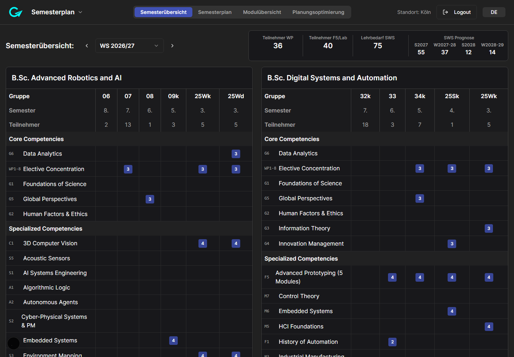
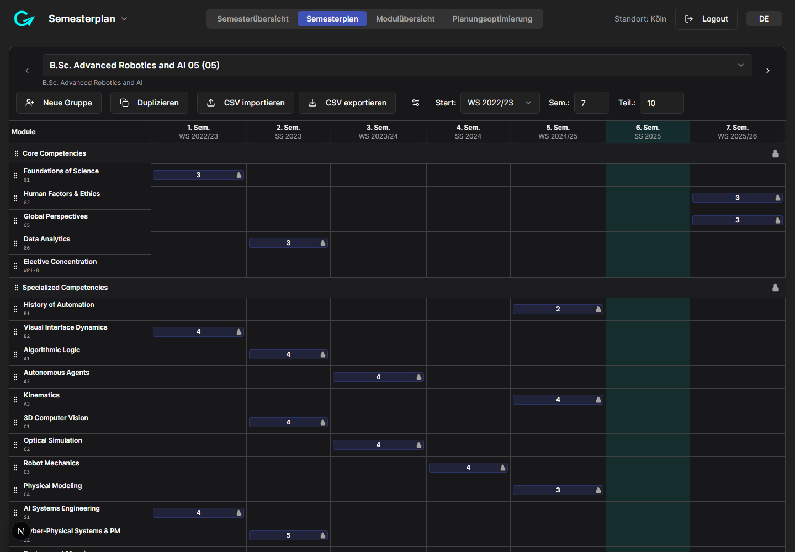
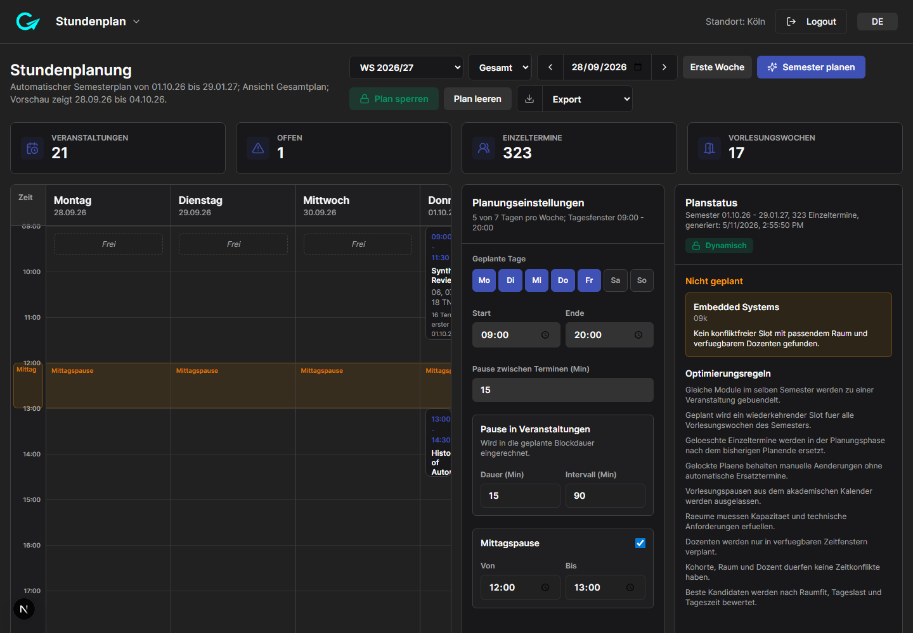
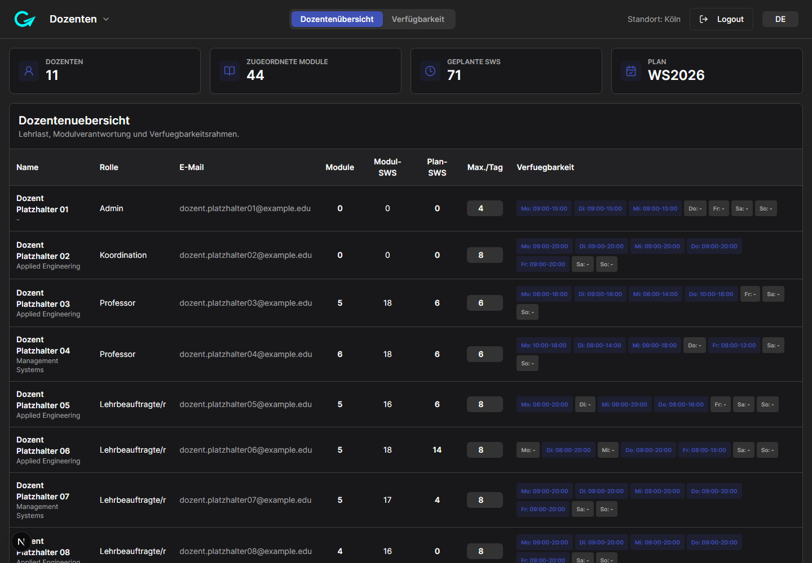

### Why I Built It

Every semester I watched the same thing happen: a degree programme gets planned
across a spreadsheet, a PDF module handbook, a room list somebody maintains
separately, and a timetable assembled by hand at the end. Each artefact is
internally consistent and none of them agree with each other. The conflicts only
surface when a room is double-booked or a cohort is scheduled into a module whose
prerequisite they have not taken yet.

**CoursePilot** is my attempt to put the whole thing into one model. It is the
project I keep returning to — the highest commit count of anything in my personal
portfolio — because every semester of real teaching surfaces another edge case
the model did not cover.

### What It Actually Does

It is not a course catalogue. It is a planning instrument with four connected
surfaces:

- **Curriculum.** Cohort-specific study-progress plans with drag-and-drop module
  placement, validated live against prerequisites, forbidden semesters, duplicate
  pool modules, and locked modules. Moving a module that breaks a rule tells you
  so at the moment you move it, not in week three.
- **Modules.** Module-sheet editing — categories, workload, teaching format, room
  requirements, programme assignment — held as data rather than as prose in a PDF.
- **Rooms.** Inventory, occupancy, availability, capacity and equipment.
- **Teaching load.** Lecturer overview with assigned modules, daily SWS limits and
  availability windows.

The part I find most interesting is what sits on top of those four: **automated
weekly schedule generation**. Given the cohort plans, room capacity and equipment,
room blocks, and lecturer availability, it produces a weekly timetable and reports
the conflicts it could not resolve. That is a genuine constraint-satisfaction
problem, and the honest result is that the machine solves the easy 90% and hands
the residue back to a human — which is the right division of labour, but only
becomes visible once you build it.

### Technical Notes

Next.js 15 (App Router), React 18, TypeScript 5, Tailwind, Radix and
`@hello-pangea/dnd` for the plan boards. It runs **local-first**: the entire data
set is a folder of JSON files (`modules`, `programs`, `cohorts`, `rooms`,
`room-occupancy`, `lecturer-availability`, `academic-calendar`, `schedule`) read
and written through a server API route. Setting a single environment variable
switches persistence to a PocketBase instance for shared deployments, with a
fallback to local JSON if the remote read fails.

The UI carries German and English labels throughout, because the terminology
(*SWS*, *Studienverlaufsplan*, *Modulhandbuch*) does not survive translation
cleanly and the people using it work in both.

### Status

Actively developed and deliberately unfinished. The planning, module, room and
settings surfaces are real; examinations, user profiles and user groups are
scaffolded placeholders. The source is *source-available* rather than open —
all rights reserved.

    <a href="https://cyberhirsch.github.io/CoursePilot/" class="inline-flex items-center px-8 py-4 text-lg font-bold text-white transition-all bg-primary-600 rounded-lg hover:bg-primary-500 hover:scale-105 shadow-xl shadow-primary-900/20">
        Read the Handbook &nbsp; &rarr;
    </a>

*The published site is the German documentation handbook. CoursePilot itself is a
Node application and runs locally — there is no public hosted instance.*

[View source on GitHub &rarr;](https://github.com/cyberhirsch/CoursePilot)
