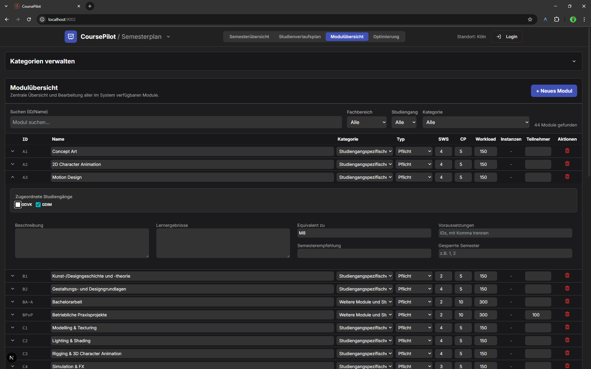

### The Project

**CoursePilot** is a semester-by-semester academic planning tool: modules, prerequisites, and degree requirements laid out so the whole path is visible at a glance instead of buried in a PDF or spreadsheet.

It's the project I keep coming back to — the highest commit count of anything in my personal portfolio, iterated over many passes as real coursework surfaced new edge cases.

### Live Experiment

    <a href="https://cyberhirsch.github.io/CoursePilot/" class="inline-flex items-center px-8 py-4 text-lg font-bold text-white transition-all bg-primary-600 rounded-lg hover:bg-primary-500 hover:scale-105 shadow-xl shadow-primary-900/20">
        Launch CoursePilot &nbsp; &rarr;
    </a>

[View source on GitHub &rarr;](https://github.com/cyberhirsch/CoursePilot)
