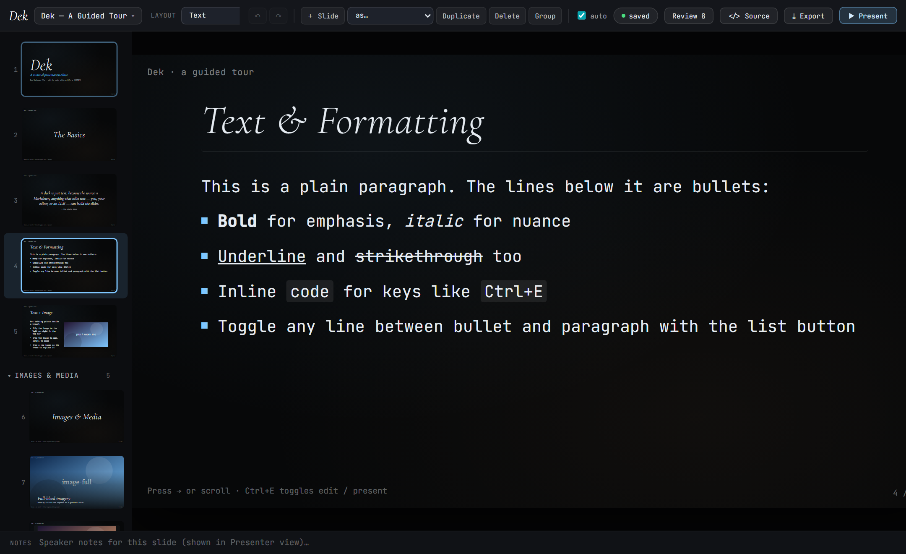
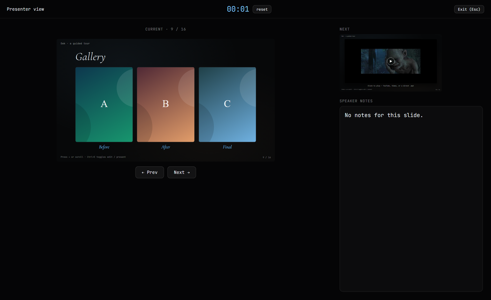

### The Premise

I give a lot of lectures, and I had grown tired of my slides living inside a
proprietary binary I could not diff, script, or hand to anything else. **Dek**
starts from one commitment: **a deck is a single Markdown file**, and every way of
editing it writes the same fields.

There are three such ways, and they are genuinely interchangeable:

1. **In code** — open `deck.md` in any text editor.
2. **By LLM** — hand the `.md` to a model. The schema is named-field and
   LLM-native, so its edits drop straight back in.
3. **WYSIWYG** — edit visually in the browser, including a free-positioning canvas.

You can move between all three mid-deck without losing anything. That is not a
convenience feature; it is the entire design thesis, and everything else follows
from holding it.

### Why the Round-Trip Is the Hard Part

Making a Markdown-to-slides renderer is a weekend. Making one where the visual
editor writes back into the text *losslessly* is the actual work, and it is where
most tools of this kind quietly give up.

- **Lossless round-trip.** Unknown fields survive verbatim, so the schema can grow
  without breaking older decks. `parse ⇄ serialize` is verified by the test suite.
- **Reversible layout switching.** Fields the current layout does not render are
  parked under `stash:` rather than dropped — so `text → statement → text` is
  non-destructive.
- **Baking.** The moment you drag something freely on a semantic slide, its layout
  flips to `freeform` and the layout's content is *baked* into editable elements.
  Nothing is lost; the slide simply becomes a canvas.

Twelve built-in layouts (cover, section, statement, speaker, text, text-image,
image-full, image-caption, video-embed, gallery, diagram, freeform), plus a
free-positioning element layer measured in 1280×720 stage pixels so it scales with
the slide. One unified `box` primitive backs text, shapes and images — a rectangle
is a box with a fill, a text box is a box with a transparent fill and content, and
a box can be all three at once.

### The Design System Is Part of the Tool

Dek ships with an opinion, and I think that is correct for a teaching instrument.
Its visual language is documented in the repository as an actual design system:
**Cormorant Garamond** in light italic for headings over **JetBrains Mono** body
text, a near-black `#070809` ground, a blue `#7fc7ff` accent with amber secondary,
and a hard rule against setting anything in all caps.

Defaults are pedagogy. A tool with no opinion produces slides with no opinion, and
students inherit whatever the default template happened to be. I would rather
argue for a position than pretend the template is neutral.

### Practical Notes

Vue with a Vite dev server backed by a real file API — it reads and writes an
actual `deck.md` on disk with hot reload. Open/Save-As to local files uses the File
System Access API (Chrome, Edge, Brave). Mermaid diagrams render live from source
in `diagram` slides. Speaker notes persist as `notes:` and appear in presenter view.

Your slides stay yours: `deck.md` and `public/Assets/` are gitignored. The
repository ships the *tool*, not anybody's talks.

Several of the lecture decks published on this site were built with it.

    <a href="https://cyberhirsch.github.io/Dek/" class="inline-flex items-center px-8 py-4 text-lg font-bold text-white transition-all bg-primary-600 rounded-lg hover:bg-primary-500 hover:scale-105 shadow-xl shadow-primary-900/20">
        Launch Dek &nbsp; &rarr;
    </a>

[View source on GitHub &rarr;](https://github.com/cyberhirsch/Dek)
