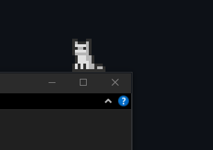

### The Project

Desktop pets are an old genre — Shimeji, Neko, the Clippy lineage — and almost all
of them share one limitation: they live on a transparent overlay that knows
nothing about what is underneath it. They walk on the bottom of the screen because
the bottom of the screen is the only surface they can be sure exists.

**Desktop Kitten** queries the operating system for the actual rectangles of your
open windows and treats their top edges as platforms. It walks along the title bar
of your code editor, naps on your browser, and falls when you move the window out
from under it — because gravity is implemented and the platform genuinely
disappeared.

That is the whole idea, and I like it because it is a small, sharp demonstration
of something I try to get across in teaching: the difference between a thing drawn
*over* an interface and a thing that is *aware of* one. The visual layer is nearly
identical. The behaviour is not remotely.

### Behaviour

- **Window-top walking** — real window rectangles as platforms, so the kitten roams
  the whole screen rather than a strip at the bottom.
- **Physics** — gravity, jumping and falling. Drop it, or pull its platform away,
  and it tumbles.
- **Ten-plus animation states** — walking, running, sleeping, licking, being
  carried, and more.
- **Interaction** — left-click and drag to pick it up; scroll the mouse wheel over
  it to pet it and hear it purr; right-click to feed it.

Crisp 32×32 pixel animations, nearest-neighbour scaled so they stay sharp on any
monitor.

### Technical Notes

Python with **PyQt6** — a frameless, transparent, always-on-top window. The
interesting part is the collision engine, which is necessarily platform-specific:
`win32gui` on Windows to enumerate window rectangles, and **Quartz** (CoreGraphics)
via `pyobjc` on macOS. Custom sprite engine, `QMediaPlayer` for audio.

It bundles to a standalone executable with PyInstaller, so the end user needs no
Python installation.

    <a href="https://cyberhirsch.itch.io/desktop-kitten-pet" class="inline-flex items-center px-8 py-4 text-lg font-bold text-white transition-all bg-primary-600 rounded-lg hover:bg-primary-500 hover:scale-105 shadow-xl shadow-primary-900/20">
        Get it on itch.io &nbsp; &rarr;
    </a>

Free, on a pay-what-you-want basis. The [itch.io
release](https://cyberhirsch.itch.io/desktop-kitten-pet) carries ready-to-run
builds for both platforms — Windows (46 MB) and macOS (100 MB) — with no Python
installation required, and the full source is on
[GitHub](https://github.com/cyberhirsch/Kitten) if you would rather clone it and
run `python main.py` yourself.
