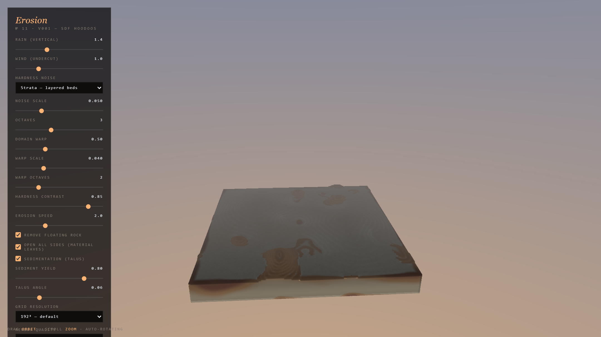

### The Experiment

Almost all terrain erosion in graphics operates on a **heightmap**: one elevation
per horizontal position. That representation is efficient and it is also a hard
ceiling, because it cannot express any geometry where a vertical line crosses the
surface more than once. No overhangs. No arches. No undercut hoodoos — which is
to say, none of the landforms that make desert rock recognisable.

**Erosion** discards the heightmap and weathers a genuine **volumetric density
field** on the GPU instead.

### Differential Erosion

The rock is deposited as bands of differing hardness, and this is what does the
visual work. Rain attacks the field vertically while wind attacks it laterally;
because the bands resist at different rates, softer strata retreat faster than
the harder layers above them. The harder layer is left unsupported and
overhanging — the mechanism that produces the capstone silhouette of a real
hoodoo, and the mechanism a heightmap structurally cannot reproduce.

Given long enough, laterally eroding pockets meet through a fin and open into an
arch. That is not a special case in the code; it is simply what happens when
material is removed from a field that was never constrained to be single-valued.

The surface is raymarched directly from the density field, so what is displayed
is the simulation state itself rather than a mesh extracted from it.

*The same solver underpins the erosion nodes in [Voxelbox](/rnd/voxelbox/), where
it sits inside a node graph rather than running standalone.*

### Live Experiment

    <a href="https://cyberhirsch.github.io/Experiments/11_Erosion/Erosion_v001_SDF.html" class="inline-flex items-center px-8 py-4 text-lg font-bold text-white transition-all bg-primary-600 rounded-lg hover:bg-primary-500 hover:scale-105 shadow-xl shadow-primary-900/20">
        Launch Erosion &nbsp; &rarr;
    </a>

*(Requires a WebGPU-capable browser and GPU. Best experienced on desktop.)*

[View the Experiments collection &rarr;](https://github.com/cyberhirsch/Experiments)
