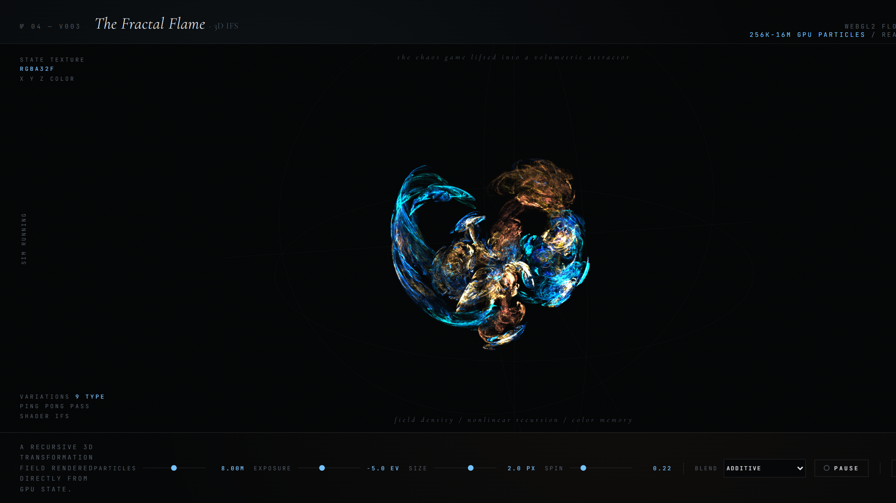

### The Experiment

Scott Draves' fractal flame algorithm is one of the few pieces of generative art
software I would call genuinely canonical, and I had never implemented it. That
seemed like a gap worth closing — particularly since the 3D case forces decisions
the 2D original never had to make.

The *chaos game* is deceptively simple: pick a point, repeatedly apply a randomly
chosen transformation from a small set, and plot where you land. Do it long
enough and the points converge onto an attractor whose structure none of the
individual transformations obviously contains.

**Flame Fractals** lifts that procedure into 3D and runs it entirely on the GPU.

### How It Works

Particle state lives in an `RGBA32F` texture — `X`, `Y`, `Z`, and an accumulated
colour index — and is advanced by a ping-pong pass in which the fragment shader
*is* the IFS. Nine nonlinear variations are available; each iteration selects one
stochastically and writes the transformed position straight back into the state
texture. Nothing round-trips to the CPU, so between 256 thousand and 16 million
particles can be iterated in real time.

Two details matter for the image quality:

- **Statistical density estimation.** The output is not a scatter plot of points but an accumulation buffer. Regions the attractor visits more often accumulate more energy, and the tone-mapped result — exposure is exposed as a control in EV — reveals the delicate density gradients that give fractal flames their characteristic depth.
- **Colour memory.** Each particle carries a colour index that is blended, not replaced, on every iteration. A point's hue therefore encodes the *history* of transformations that produced it, which is what separates the structure visually rather than merely tinting it.

### Live Experiment

    <a href="https://cyberhirsch.github.io/Experiments/01_Flame/Flame3d_v003.html" class="inline-flex items-center px-8 py-4 text-lg font-bold text-white transition-all bg-primary-600 rounded-lg hover:bg-primary-500 hover:scale-105 shadow-xl shadow-primary-900/20">
        Launch Flame Fractals &nbsp; &rarr;
    </a>

*(Requires WebGL2. Best experienced on desktop.)*

[View the Experiments collection &rarr;](https://github.com/cyberhirsch/Experiments)
