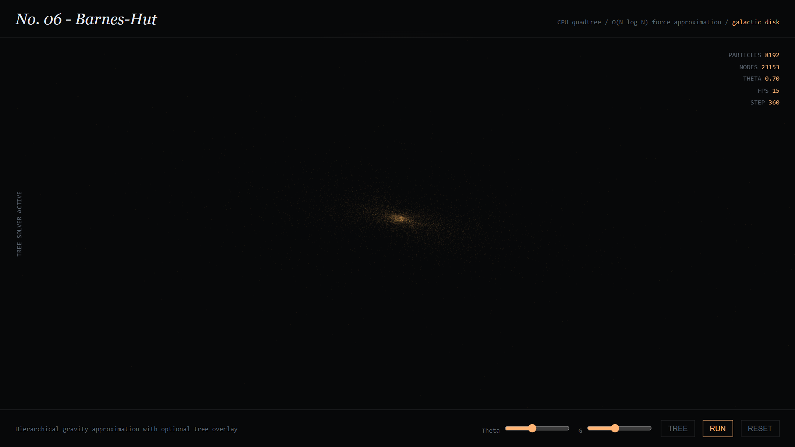

### The Experiment

Galaxies are not designed objects; they are what a large number of gravitating
masses settle into. Spiral arms, bars, and the tidal bridges drawn between
colliding galaxies are all emergent — no rule in the simulation mentions any of
them, they simply fall out of many bodies obeying Newton at once.

### The Cost Problem

Gravity is the awkward force to simulate because it never falls off to nothing.
Every particle pulls on every other, so the direct calculation is O(N²) — fine at
ten thousand particles, hopeless at a million.

Two implementations are built:

- **v001 — Brute force**, the full O(N²) sum, kept as exact ground truth to validate the approximation against.
- **v002 — Barnes-Hut**, a hierarchical quadtree in which a sufficiently distant cluster of masses is treated as a single body at its centre of mass. That drops the cost to O(N log N) and is what's running above — 8,192 particles, ~23,000 tree nodes rebuilt every step.

The frame rate in the readout (15 FPS in this build, on a CPU quadtree) is the
honest number: Barnes-Hut is the right *algorithmic* complexity, but a
pointer-chasing tree traversal is exactly the workload a GPU handles worst, which
is what makes a compute-shader port of this the more interesting problem than the
physics itself.

### Live Experiment

    <a href="https://cyberhirsch.github.io/Experiments/06_Galactica/Galactica.html" class="inline-flex items-center px-8 py-4 text-lg font-bold text-white transition-all bg-primary-600 rounded-lg hover:bg-primary-500 hover:scale-105 shadow-xl shadow-primary-900/20">
        Launch Galactica &nbsp; &rarr;
    </a>

*(Both the brute-force and Barnes-Hut versions are offered from the launch page.)*

[View the Experiments collection &rarr;](https://github.com/cyberhirsch/Experiments)
