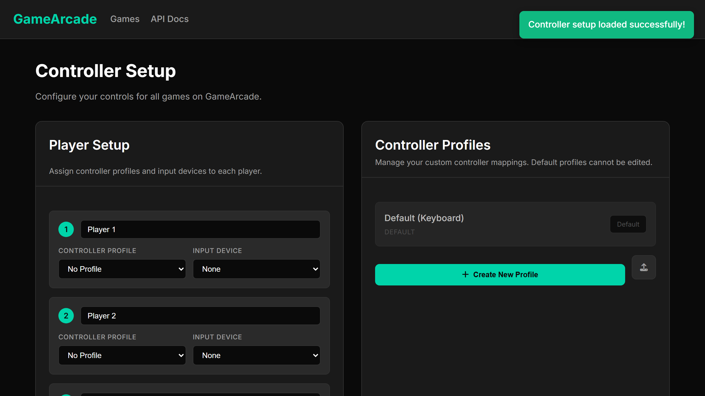

### The Project

Browser games each reinvent input handling, which means every one of them has its
own idea of what the buttons do and none of them remember your gamepad. The
per-game remapping screen is a symptom: a concern has been pushed down to a layer
that has no business owning it.

**GameArcade** pulls it back up. Controller profiles and device assignments are
configured **once**, for up to four players, and every game hosted on the arcade
reads from the same configuration.

Custom profiles can be created and remapped freely. Defaults are provided and
protected from editing, so there is always a known-good fallback to return to when
an experiment goes wrong — a small design decision that saves a genuinely
disproportionate amount of frustration.

A documented API lets a game opt into the layer rather than parsing raw key events
itself.

### Why This Interests Me

The technical content is modest; the architectural lesson is not. Deciding *which
layer owns a concern* is the recurring question in interactive systems design, and
input is an unusually clean case to reason about because everyone has felt the
failure mode personally.

It is also a case where the right answer costs the individual game almost nothing
and pays back across every game on the platform — which is exactly the shape of
argument that infrastructure work always has to make, and rarely gets to make this
legibly.

    <a href="https://cyberhirsch.github.io/GameArcade/" class="inline-flex items-center px-8 py-4 text-lg font-bold text-white transition-all bg-primary-600 rounded-lg hover:bg-primary-500 hover:scale-105 shadow-xl shadow-primary-900/20">
        Open GameArcade &nbsp; &rarr;
    </a>

[View source on GitHub &rarr;](https://github.com/cyberhirsch/GameArcade)
