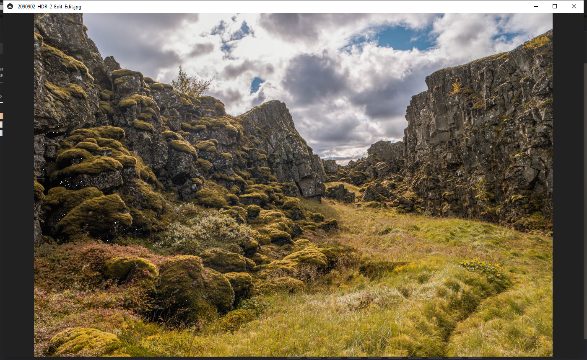

### The Project

**IQView** starts from the everyday act of looking at an image and asks what an AI model could add without breaking the flow of a normal viewer. It integrates three separate models directly into the interface:

- **LaMa** for object removal / inpainting
- **FLUX** for on-the-spot image generation
- **SAM3** for one-click segmentation

Rather than round-tripping to a separate tool for each of these, they sit behind the same lightweight viewer.

The viewer itself stays out of the way — a fast, near-chromeless C++ image
window. The models are available from it rather than imposed on it, which is the
whole design premise: the cost of trying an AI operation should be one click from
looking at the picture, not a context switch into a different application.

[View source on GitHub &rarr;](https://github.com/cyberhirsch/IQView)
