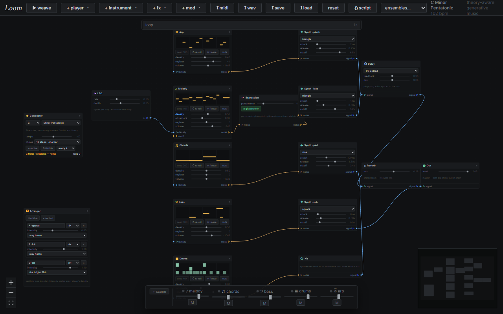

### The Project

**Loom** inverts how a sequencer usually works. Rather than placing notes on a
grid, you patch together an ensemble — melody, chords, bass, drums, arp — and
direct it. A **Conductor** node sets the ambient rules of the room (key, scale,
tempo, phrase length) and every player generates against them, with voice-leading
rules baked in: stepwise motion, leap recovery, chord-tone pull, question/answer
phrasing, and proper cadences.

The patch *is* the signal flow. Players emit notes only; nothing makes a sound
until those notes reach an instrument whose signal reaches **Out**. Cut a cable
and that player genuinely goes silent — enforced by the engine, not simulated.

### Key Features

- **Rust → WASM DSP core** running in an AudioWorklet: voices, ADSR, filters, a synthesized drum kit, tempo-synced ping-pong delay, reverb, and a soft-clip limiter. The same crate is built to compile for a native Tauri sidecar.
- **Seeded and deterministic** — the same seed reproduces the same music exactly, verified by test. Re-roll for a new take, or **freeze** a player so its current take survives every mutation.
- **LoomScript** — the entire patch as a readable line-based DSL: every node, knob, cable, frozen take, and scene. It *is* the save format, it round-trips idempotently, and it is editable by hand or by an LLM.
- **Motif node** applies a Schoenberg-style sentence grammar (statement / restatement / contrast / cadence) with auditioned takes, turning random melody into something thematic.
- **Self-listening modulation** — patch the Tension node's CV into a player's density and the ensemble balances itself: saturated loops breathe out, sparse loops build.
- **Exports** — Standard MIDI File (one track per player, drums on GM channel 10) and an offline WAV bounce rendered ~30× faster than real time through the same DSP.

### Live Experiment

    <a href="https://cyberhirsch.github.io/loom/" class="inline-flex items-center px-8 py-4 text-lg font-bold text-white transition-all bg-primary-600 rounded-lg hover:bg-primary-500 hover:scale-105 shadow-xl shadow-primary-900/20">
        Launch Loom &nbsp; &rarr;
    </a>

*(Press **▶ weave** — the default ensemble is already patched and starts playing in C Minor Pentatonic.)*

[View source on GitHub &rarr;](https://github.com/cyberhirsch/Loom)
