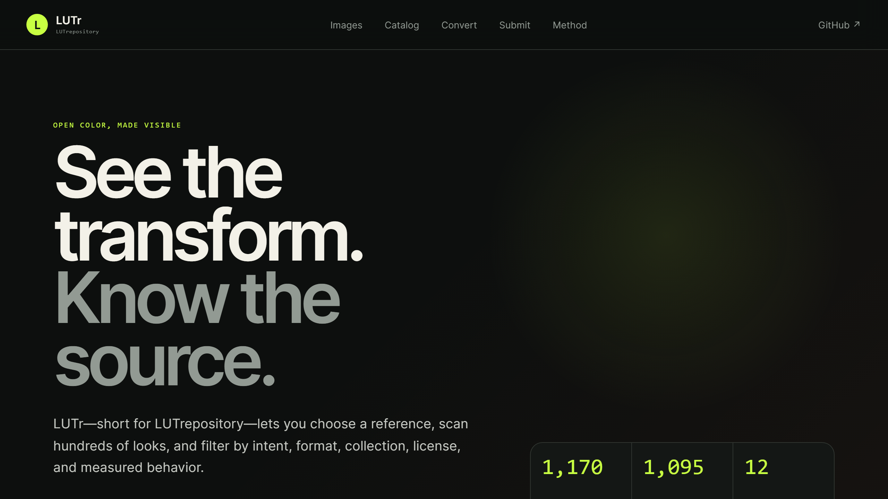

### The Project

**LUTr** — short for *LUT repository* — is a visual catalog for browsing open
lookup-table collections against curated reference images. The problem it solves
is mundane and universal: LUTs circulate in half a dozen incompatible formats,
usually with no reliable statement of what colour space they expect on input or
produce on output, so evaluating one means guessing.

### How It Works

Every LUT hosted by the site is normalised to a metadata-rich `.cube`. The
conversion pipeline ingests 3DL, CSP, Hald and strip LUT images, and the
supported ACES CLF operation set, retaining the original samples alongside the
canonical file. A committed manifest records source checksums, conversion method,
grid size, colour-space confidence, and any known limitation for each file — so
a questionable conversion is visible rather than silently wrong.

Rendering happens entirely in the browser. WebGL parses the canonical CUBEs
directly as floating-point textures and composes the declared image space, LUT
input space, LUT output space, and the sRGB display conversion in one pass.
LUT-applied previews are never stored; they are always computed.

### Key Features

- Faceted include/exclude filters with measured sorting
- Provenance and licence metadata on every entry
- A colour-managed before/after viewer, and multi-LUT comparison
- Local image upload — evaluate against your own frame, not just the references
- A local LUT converter and downloadable converted CUBEs

### Live Experiment

    <a href="https://cyberhirsch.github.io/LUTr/" class="inline-flex items-center px-8 py-4 text-lg font-bold text-white transition-all bg-primary-600 rounded-lg hover:bg-primary-500 hover:scale-105 shadow-xl shadow-primary-900/20">
        Launch LUTr &nbsp; &rarr;
    </a>

[View source on GitHub &rarr;](https://github.com/cyberhirsch/LUTr)
