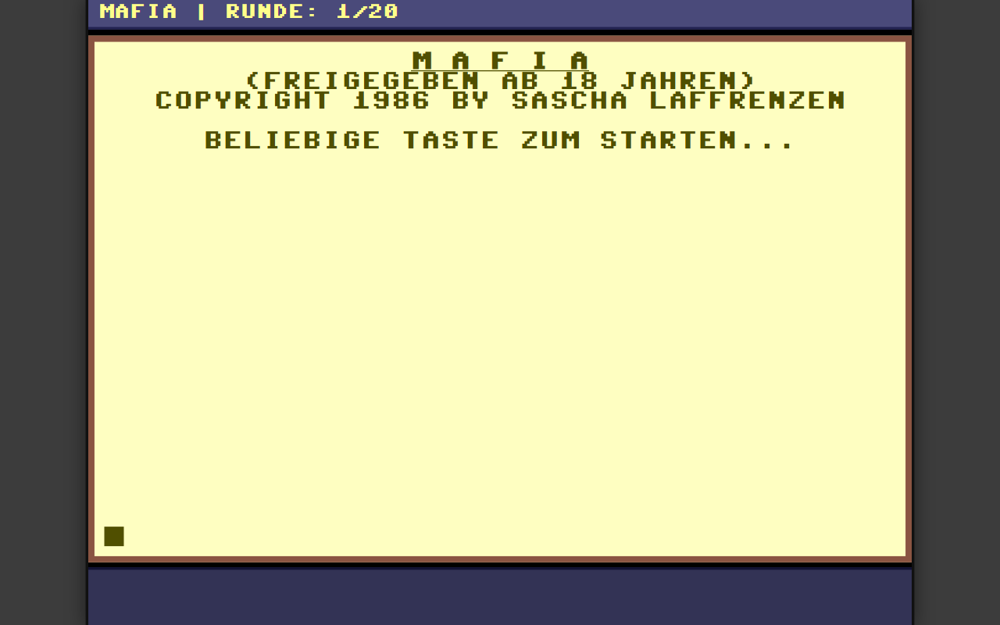

### The Project

**Mafia** is a turn-based strategy game from 1986, written for the Commodore 64
by Sascha Laffrenzen. This is a recreation of it for the browser — the look, the
feel, and the mechanics, rather than an emulation.

You play an aspiring underworld figure in Hademarschen: start with petty thefts,
push the proceeds into increasingly illicit businesses, recruit henchmen, bribe
officials, and squeeze your rival out.

### Key Features

- **Authentic C64 presentation** — period pixel font, the original colour palette, and an interface that scales to any window while preserving the retro aspect ratio and pixel fidelity.
- **The original phase structure** — an *Aufbauphase* limited to small thefts, opening into a main phase with investments, recruitment, and bribery.
- **The full mechanic set** — theft options with distinct risk/reward profiles (some of which hit your opponent), investments from slot machines up to grand hotels, personnel ranging from gunmen to lawyers and informants, and officials to bribe from the *Polizeiwachtmeister* to the *Bürgermeister*.
- **Consequences preserved** — a jail system for failed crimes with knock-on effects on your operations, random *Schicksalsschläge* that target the wealthier player, and the original six-round bankruptcy recovery.
- **Vanilla HTML, CSS, and JavaScript** — no framework, no build step.

### Live Experiment

    <a href="https://cyberhirsch.github.io/Mafia/" class="inline-flex items-center px-8 py-4 text-lg font-bold text-white transition-all bg-primary-600 rounded-lg hover:bg-primary-500 hover:scale-105 shadow-xl shadow-primary-900/20">
        Play Mafia &nbsp; &rarr;
    </a>

[View source on GitHub &rarr;](https://github.com/cyberhirsch/Mafia)
