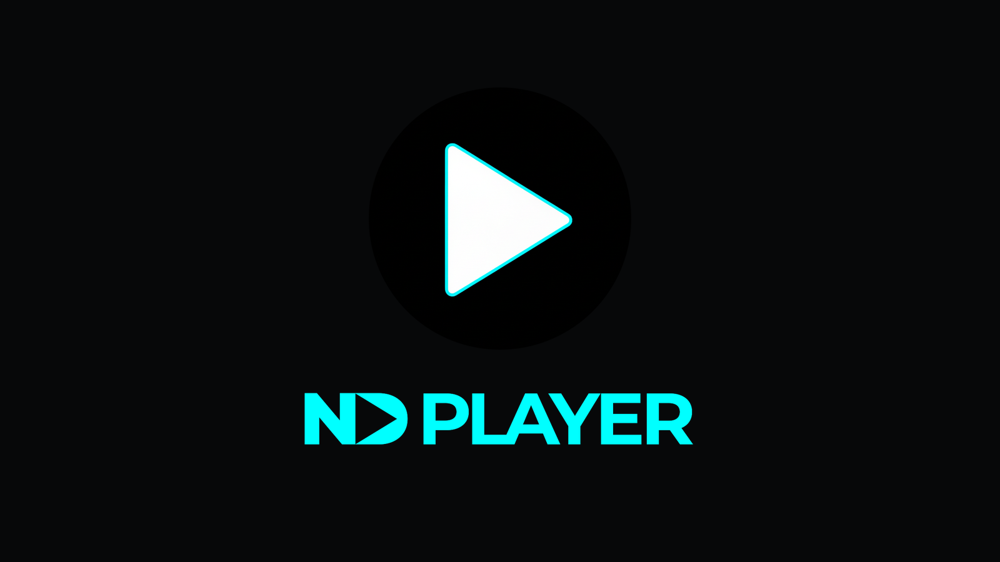

### The Project

[Navidrome](https://www.navidrome.org/) is a self-hosted music server: your own
files, your own machine, no subscription and no catalogue that can be revoked
from under you. Its weak point has always been the mobile clients.

**ND Player** is mine. React Native and Expo, talking to the **Subsonic REST API**
(v1.16.1) — a two-decade-old interface that half a dozen server implementations
still honour, which is exactly why building against it is worth doing. A client
written for a stable open protocol outlives the specific server it was written
for.

It is the mobile project I have iterated on most, almost entirely around the two
things that actually determine whether a music player is usable: playback
reliability and library navigation at scale.

### What It Does

- **Browse** albums, artists and playlists from the server.
- **Songs tab** with infinite scroll and live search — the difference between a
  library you can use and one you can only admire.
- **Starred / favourites** filtering across albums and songs.
- **Offline playback** — download whole albums and playlists to the device. Real
  files on real storage, not a cache that evaporates.
- **Now-playing bar** with queue management and repeat modes (off / all / one).
- **Dark mode** following the system setting.

### Stack

| Layer | Choice |
|---|---|
| Framework | Expo SDK 54 with `expo-router` |
| State | Zustand |
| Audio | `expo-av` |
| Storage | `expo-secure-store` + `expo-file-system` |
| API | Subsonic REST v1.16.1 |

Production builds go through EAS to an Android App Bundle. Server credentials go
into secure storage, never a plain preferences file.

[View source on GitHub &rarr;](https://github.com/cyberhirsch/ND-Player)

*Source-only — no public build published yet. All rights reserved; provided for
personal use.*
