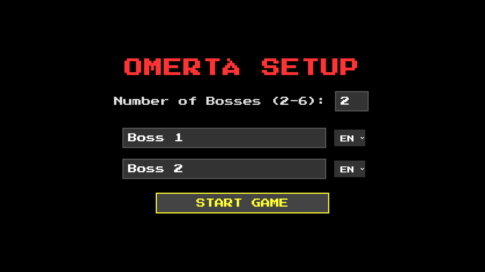

### The Project

**Omertà** takes the classic property-management board game and moves it to 1920s
Prohibition. Two to six Mob Bosses compete for control of the City of Silence
through intimidation, bribery, and expansion, with the goal of bankrupting the
rest and becoming *Capo di tutti i capi*.

### Design Notes

The interesting part is what the game *hides*. Dice are rolled in the background
at the start of a turn and the crew moves immediately, so the player never
watches a counter shuffle around a board. What they get instead is a narrated
arrival — "your crew arrives at the Dive Bar" — followed by their actual choices.
The intent is to shift the experience from *playing a board game* to *running a
criminal organisation*.

The vocabulary follows: rent becomes **tribute**, houses and hotels become
**Muscle** and **Racket Hubs**, jail becomes **The Cooler**, and tax becomes a
laundering fee or a bribe to the mayor. Territories can only be improved once a
Boss controls a full colour group, and an unimproved full set already collects
double.

Forty spaces make up the board: turf, transportation routes whose value scales
with how many you hold, rackets with variable tribute, the Don's Mansion, the
Cooler, and Hit List / Favors event cards.

### Presentation

High-contrast 8-bit pixel art — neon red and yellow on deep black, *Press Start
2P* throughout, with subtle scanlines and colour bleed simulating a vintage
terminal. Playable in English, German, and Turkish.

### Live Experiment

    <a href="https://cyberhirsch.github.io/Omerta/" class="inline-flex items-center px-8 py-4 text-lg font-bold text-white transition-all bg-primary-600 rounded-lg hover:bg-primary-500 hover:scale-105 shadow-xl shadow-primary-900/20">
        Play Omertà &nbsp; &rarr;
    </a>

[View source on GitHub &rarr;](https://github.com/cyberhirsch/Omerta)
