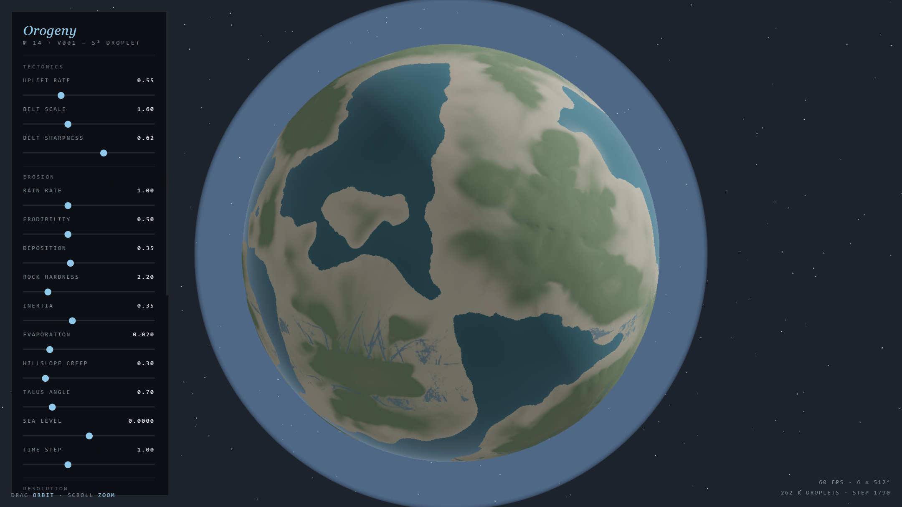

### The Experiment

**Orogeny** runs the full erosional cycle on an entire planet at once. Tectonic
uplift raises relief; hundreds of thousands of droplets carve drainage networks
into it; the sediment they detach is transported downstream and deposited, filling
basins and building deltas where rivers meet sea level. Left running, the planet
settles into equilibrium — the rate at which mountains rise balanced against the
rate at which water takes them apart.

### The Sphere Problem

Simulating on a sphere is where this kind of thing normally goes wrong. A
latitude–longitude grid has cells that shrink to nothing at the poles, so both
the timestep and the erosion rate become position-dependent and the poles develop
visible artefacts. Orogeny uses a **cubed sphere** — six square grids projected
onto the sphere — which avoids the singularity but introduces a different
problem: twelve seams, and eight corners where three faces meet.

Three things make it genuinely seamless:

- **Metric-correct operators.** Projecting a square onto a sphere distorts it, and the distortion varies across each face. Gradients and flow directions are computed against the local metric, so a droplet does not accelerate or turn merely because it crossed into a differently-stretched part of the grid.
- **Ghost-cell halos.** Each face carries a border of cells mirrored from its neighbours, so a droplet approaching an edge sees real terrain beyond it rather than a boundary. Rivers cross seams without noticing they exist.
- **A mass ledger.** Every gram of rock detached, carried and deposited is accounted for, and the books close to **0.02%**. This is the honest measure of whether the simulation is physical or merely decorative — an erosion model that silently creates or destroys material will look plausible for a while and then drift into nonsense.

### Live Experiment

    <a href="https://cyberhirsch.github.io/Experiments/14_Orogeny/Orogeny_v003.html" class="inline-flex items-center px-8 py-4 text-lg font-bold text-white transition-all bg-primary-600 rounded-lg hover:bg-primary-500 hover:scale-105 shadow-xl shadow-primary-900/20">
        Launch Orogeny &nbsp; &rarr;
    </a>

*(Requires WebGL2. Best experienced on desktop.)*

[View the Experiments collection &rarr;](https://github.com/cyberhirsch/Experiments)
