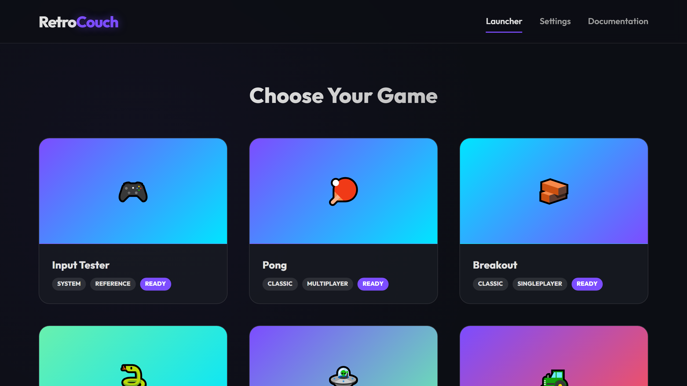

### The Problem It Solves

Every browser game reinvents input handling, and every one of them does it
slightly differently. The consequence is familiar to anyone who has tried to put
four people in front of one screen: none of the games agree on what the buttons
do, none of them remember your gamepad, and every session begins with five
minutes of negotiation.

**RetroCouch** pulls that concern out of the games entirely and into a platform
layer — the **Universal Controller System**.

### The Abstraction

Keyboards, modern gamepads and retro controllers all arrive through the browser's
Gamepad API in different shapes. UCS normalises them into one fixed vocabulary of
**game actions**:

- **Face buttons:** `actionSouth`, `actionEast`, `actionWest`, `actionNorth`
- **Directional:** `leftStickX/Y`, `rightStickX/Y`, `dpadUp/Down/Left/Right`
- **Shoulders:** `leftBumper`, `rightBumper`, `leftTrigger`, `rightTrigger`
- **Special:** `start`, `select`, `leftStickPress`, `rightStickPress`

A game reads `actionSouth`. It never learns what device produced it, and it never
needs a driver, a hardware quirk table, or a remapping screen of its own.

The naming is directional (`actionSouth`) rather than lettered (`A`), which is a
small decision with a real payoff: Xbox, PlayStation and Nintendo layouts disagree
about which letter sits where, and physical position is the only thing all three
actually share.



Profiles are created and remapped through a live "listening" system — press the
button you want, it binds. Up to four players, each with their own name, device
and profile. Defaults are provided and protected from editing, so there is always
a known-good fallback to return to.

### For Developers

Games register themselves in a central metadata file and export a single lifecycle
function:

```javascript
export function initGame(canvas, controllerSystem) {
    return {
        start() {},   // setup
        stop() {},    // cleanup
        update() {},  // logic
        draw() {},    // rendering
        resize() {}   // scaling
    };
}
```

That is the entire contract. The hub supplies the canvas and the already-configured
controller system; the game supplies five methods. I find this a genuinely good
teaching example of what an abstraction layer is *for* — the interface is small
enough to read in one breath, and it eliminates an entire class of work from every
game that adopts it.

Built-in developer documentation covers third-party integration.

<div class="mt-8 mb-12">
    <a href="https://cyberhirsch.github.io/RetroCouch/" class="inline-flex items-center px-8 py-4 text-lg font-bold text-white transition-all bg-primary-600 rounded-lg hover:bg-primary-500 hover:scale-105 shadow-xl shadow-primary-900/20">
        Launch RetroCouch &nbsp; &rarr;
    </a>
</div>

[View source on GitHub &rarr;](https://github.com/cyberhirsch/RetroCouch)
