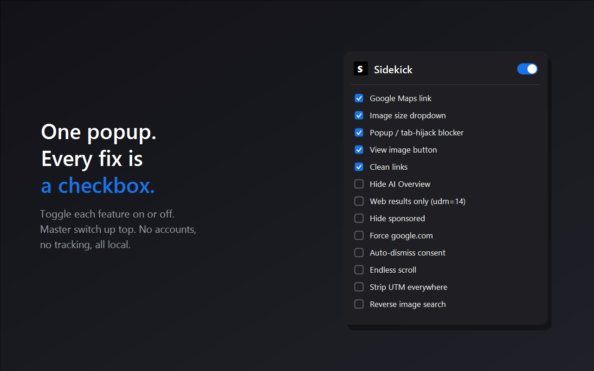
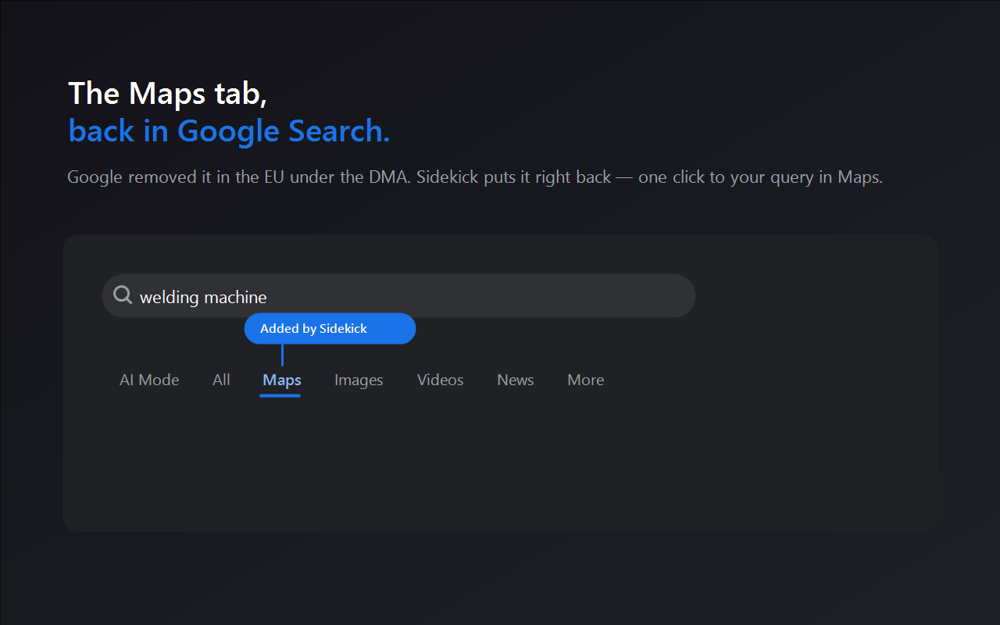
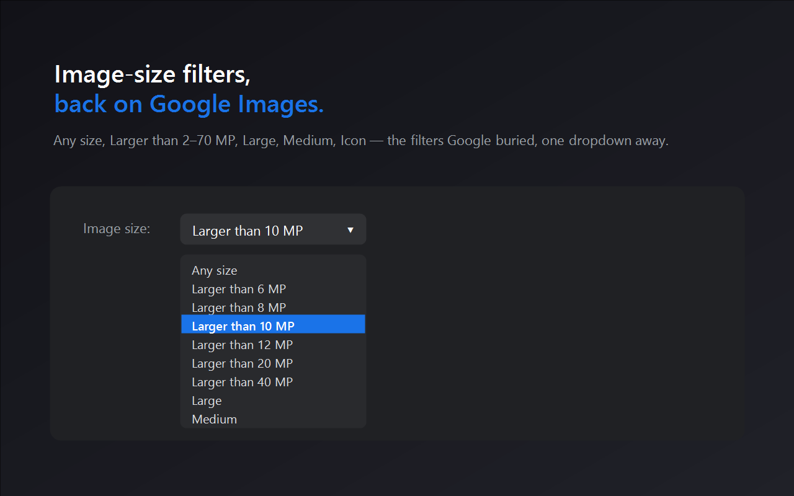

### The Project

**Sidekick** began as an irritation and turned into a study. Google Search has,
over the years, quietly removed the "View image" button, buried the image-size
filters, dropped the Maps tab for European users, and pushed an AI Overview to
the top of every result page. Each removal is small. Together they describe who
the interface is now for.

The extension is thirteen individual checkboxes in one popup, each restoring or
suppressing one of those decisions, with a master switch at the top. No accounts,
no servers, no telemetry — everything runs locally.

### What I Find Interesting About It

Not the features. The **failure modes**. Building this taught me more about
platform power than reading about it did, because every limitation is concrete
and testable:

- The **Maps tab** was removed in Europe under the Digital Markets Act. I can put
  the link back. I cannot rebuild the local "map pack" — the embedded map with
  business pins — because that content is rendered on Google's servers and never
  reaches the page at all. There is nothing for an extension to work with.
- The **View image** button only works on Google's *legacy* Images layout, where
  the result link still carries the original image URL. On the current `udm=2`
  layout, tiles link to the source page and the original URL is not present
  anywhere in the document — thumbnails are inline base64. The button cannot be
  added, full stop.
- **Hiding** the AI Overview is cosmetic; Google still generates and transmits it.
  Redirecting to the plain Web vertical (`udm=14`) means it is never generated —
  at the cost of losing knowledge panels, image packs and featured snippets. The
  two options are not interchangeable, and the trade-off is real.

That gap — between what you can *hide* and what you can *prevent* — is the whole
lesson, and it only becomes legible when you try to build it.

### Two Builds, Deliberately

The store build (`dist/`) omits two features that conflict with Google's Terms of
Service: **endless scroll** (programmatic fetching of results pages) and the
**Lens thumbnail-upload** path of reverse image search (an undocumented endpoint).
The full local build (`dist-full/`) includes both, unpacked, for anyone who wants
them.

I kept the split explicit rather than shipping everything and hoping. Where a
tool sits relative to a platform's rules is a design decision, and pretending
otherwise is how extensions get pulled.

### The Rest of the Thirteen

Clean links (unwrapping `/url?q=…` redirects and stripping `utm_*`, `fbclid`,
`gclid` and friends), a site-wide UTM stripper that cleans the address bar via
`history.replace` without reloading, sponsored-block hiding, forcing
`google.com` over regional domains, and auto-dismissing the consent
interstitial — preferring **Reject all** when it is present.

And one that has nothing to do with Google: a **popunder blocker** that overrides
`window.open` so it only succeeds within roughly a second of a genuine mouse
click on a real link, and cancels clicks on near-fullscreen invisible
`target="_blank"` overlays. Ctrl-click and middle-click still work, because those
are handled by the browser rather than by page script. It is heuristic, and I say
so in the popup.

### Privacy

The store build makes **no external network requests at all**. Nothing is
collected, profiled, or sent anywhere. The only stored state is your thirteen
toggles, in Chrome's settings sync.

    <a href="https://cyberhirsch.github.io/Sidekick/" class="inline-flex items-center px-8 py-4 text-lg font-bold text-white transition-all bg-primary-600 rounded-lg hover:bg-primary-500 hover:scale-105 shadow-xl shadow-primary-900/20">
        Launch Sidekick &nbsp; &rarr;
    </a>

[View source on GitHub &rarr;](https://github.com/cyberhirsch/Sidekick)
