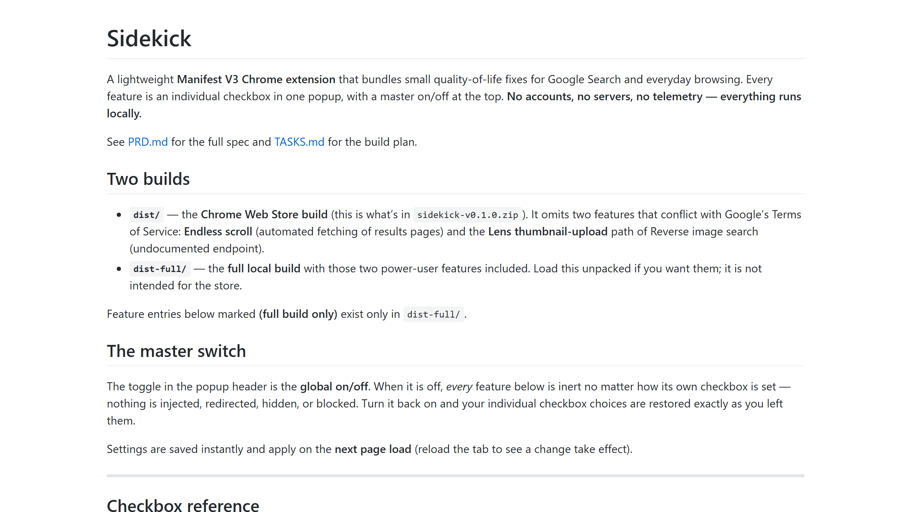

### The Project

**Sidekick** is a small collection of everyday browser conveniences bundled into a single, lightweight Manifest V3 extension: quick image-size lookups, a maps shortcut, and other small tools that don't each deserve their own extension.

### Live Experiment

    <a href="https://cyberhirsch.github.io/Sidekick/" class="inline-flex items-center px-8 py-4 text-lg font-bold text-white transition-all bg-primary-600 rounded-lg hover:bg-primary-500 hover:scale-105 shadow-xl shadow-primary-900/20">
        Launch Sidekick &nbsp; &rarr;
    </a>

[View source on GitHub &rarr;](https://github.com/cyberhirsch/Sidekick)
