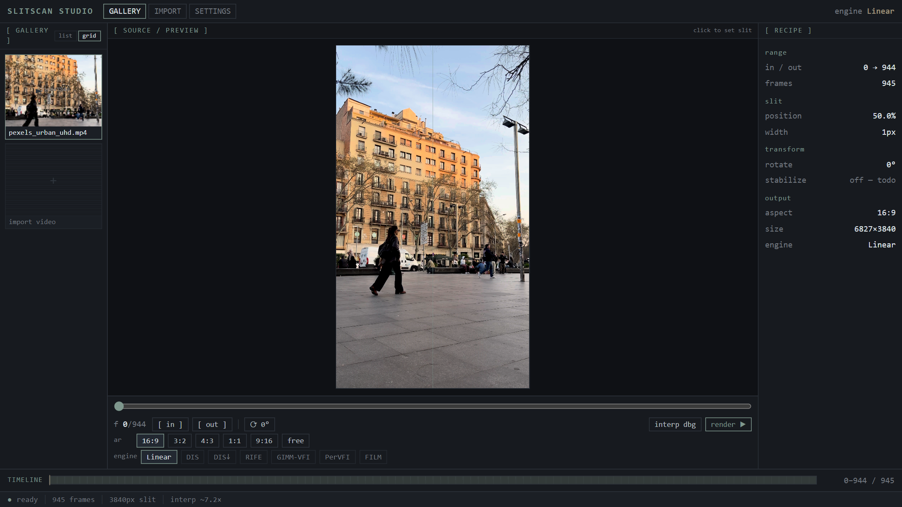

### The Technique

A slit-scan image is built from a single narrow column of pixels sampled across
many successive moments, stacked side by side. The result's horizontal axis is
therefore **time, not space** — which is why slit-scan photographs of a moving
subject look wrong in a way that is difficult to name and impossible to fake with
a filter.

I keep coming back to it as a teaching example because it dismantles the
assumption students bring to the medium: that an image is a slice of a moment. It
does not have to be.

### Non-Destructive by Construction

Most slit-scan implementations are one-shot scripts: run it, look at the output,
change a number, run it again. **Slitscan Studio** treats the whole edit as a
**recipe** — in/out range, slit position and width, rotation, output aspect and
size, interpolation engine — held entirely separately from the footage. Nothing is
baked until you render, so a slit can be repositioned and the result regenerated
without the source ever being touched.

That is an ordinary idea in colour grading and a surprisingly rare one in
generative video tooling.

### The Real Constraint: Temporal Sampling

Here is the problem that makes this interesting rather than trivial. A slit-scan
is only as smooth as its temporal sampling, and you almost never have enough
frames. 945 source frames stretched across a 3840-pixel-wide output needs roughly
**seven times more frames than exist**.

So the interpolation engine is not an implementation detail — it is the primary
creative control, and I made it swappable rather than choosing on the artist's
behalf:

- **Linear** — cross-fade baseline. Fast, and visibly wrong on fast motion.
- **DIS / DIS↓** — dense optical flow via opencv.js, motion-compensated, at full
  resolution or quarter-resolution for 4K work.
- **Neural (RIFE)** — learned frame interpolation through ONNX Runtime Web, with
  further engines stubbed in.

The pipeline is **interpolate-then-slit**, and there is an interpolation-debug
player that lets you scrub the synthesised in-between frames directly — because
when the output looks strange, you need to know whether the slit or the
interpolator produced the strangeness.

### Entirely Client-Side

WebCodecs for decode, WebGPU for compute, opencv.js for optical flow, ONNX Runtime
Web for neural inference (WebGPU with a WASM fallback). No server, no upload.

Neural model weights are **not** committed to the repository — they download once
on first use of an engine and persist in the browser's **Origin Private File
System**. Neural inference runs at native resolution, which on 4K footage is
genuinely heavy; DIS↓ is the fast path there.

The interface is a deliberately desaturated TUI. Colour in the chrome competes
with colour in the image, and for this particular tool that is a fight the chrome
should lose.

[View source on GitHub &rarr;](https://github.com/cyberhirsch/Slitscan-Studio)

*Source-only — no public hosted build yet. An Android capture companion
("Slitscanner") is a separate project.*
