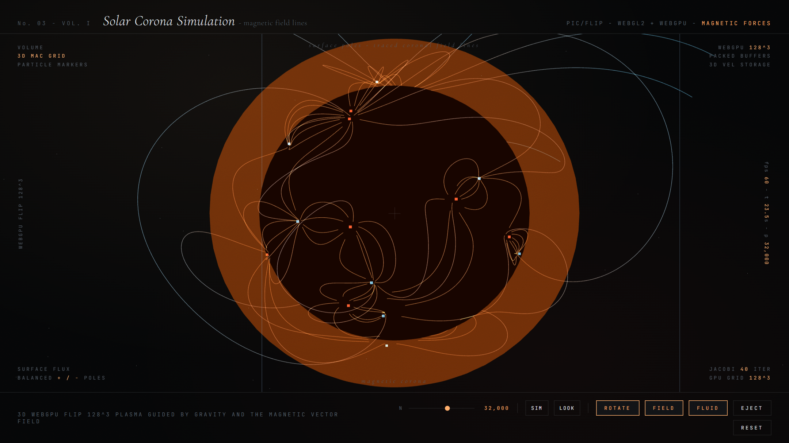

### The Experiment

The visible structure of the solar corona — the arcades of plasma that arc out of
the surface and back into it — is not really a fluid phenomenon. It is a magnetic
one. Plasma is electrically conductive, so it cannot cross field lines freely;
it is threaded onto them, and the loops we see are field geometry made visible by
the matter trapped along it.

**Solar Corona** simulates that coupling directly, extending a FLIP/PIC fluid
solver with the magnetic terms that turn hydrodynamics into
**magnetohydrodynamics**.

### Why FLIP

Purely grid-based (Eulerian) solvers smear sharp features through numerical
diffusion — fatal here, because the interesting structures *are* sharp filaments.
Purely particle-based methods conserve those features but make the pressure and
field solves awkward. FLIP takes both: particles carry the state and preserve
detail, while each step transfers to a grid to solve the field, then interpolates
the *change* back to the particles rather than the value itself. The loops stay
crisp over long runs instead of dissolving into haze.

The Lorentz force feeds back into the velocity field, so the plasma follows the
field and the field is advected by the plasma. Coronal mass ejections emerge from
that feedback — a loop's footpoints shear, magnetic tension builds, and the
structure eventually releases — rather than being scripted as an event.

### Live Experiment

    <a href="https://cyberhirsch.github.io/Experiments/03_Corona/Corona_v001.html" class="inline-flex items-center px-8 py-4 text-lg font-bold text-white transition-all bg-primary-600 rounded-lg hover:bg-primary-500 hover:scale-105 shadow-xl shadow-primary-900/20">
        Launch Solar Corona &nbsp; &rarr;
    </a>

*(Requires WebGL2. Best experienced on desktop.)*

[View the Experiments collection &rarr;](https://github.com/cyberhirsch/Experiments)
