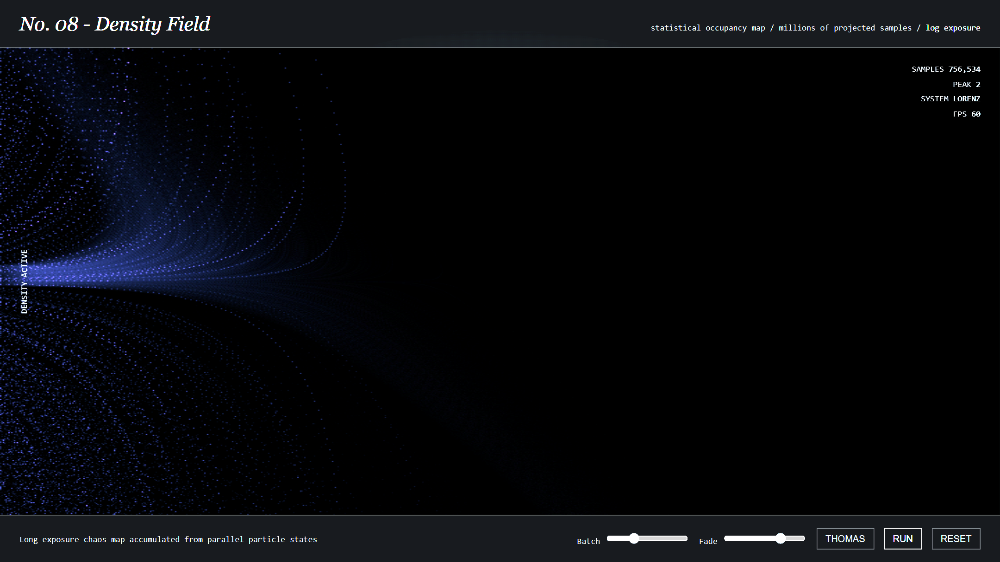

### The Experiment

A strange attractor is the resolution of an apparent contradiction: the
trajectory never repeats and is exquisitely sensitive to its starting point, yet
it is confined forever to a bounded, intricately structured region. Unpredictable
in detail, entirely predictable in shape.

The image above is not a handful of drawn orbits — it's 750,000+ samples
accumulated into a density field under log exposure, which is why the familiar
Lorenz butterfly shows up as a soft glowing braid rather than a single clean
line: every thread is thousands of nearby trajectories that have long since
diverged from one another while staying on the same surface.

### Why Precision Is the Whole Problem

This is a rendering project whose difficulty is entirely in the integrator. A
chaotic system amplifies error exponentially, so floating-point truncation is not
a cosmetic concern: a naive Euler step will drift off the attractor and produce a
plausible-looking curve that is no longer the system being claimed. The build
uses RK4 integration, because the goal is a picture of the *mathematics* rather
than a picture of the accumulated error.

- **v001 — RK4 Paths**: individual trajectories drawn as ribbons. Shows the flow and the sensitivity to initial conditions directly, since two neighbouring starts visibly separate.
- **v002 — Density Field**: massively parallel sampling accumulated into the occupancy map shown here. Discards individual paths but reveals the attractor's *measure* — which regions the system actually spends its time in, invisible in a handful of drawn orbits.

Lorenz, Aizawa, and Thomas systems are all selectable; the panel switches between
them live.

### Live Experiment

    <a href="https://cyberhirsch.github.io/Experiments/08_Strange%20Attractors/StrangeAttractors.html" class="inline-flex items-center px-8 py-4 text-lg font-bold text-white transition-all bg-primary-600 rounded-lg hover:bg-primary-500 hover:scale-105 shadow-xl shadow-primary-900/20">
        Launch Strange Attractors &nbsp; &rarr;
    </a>

*(Both the RK4 path and density-field versions are offered from the launch page.)*

[View the Experiments collection &rarr;](https://github.com/cyberhirsch/Experiments)
