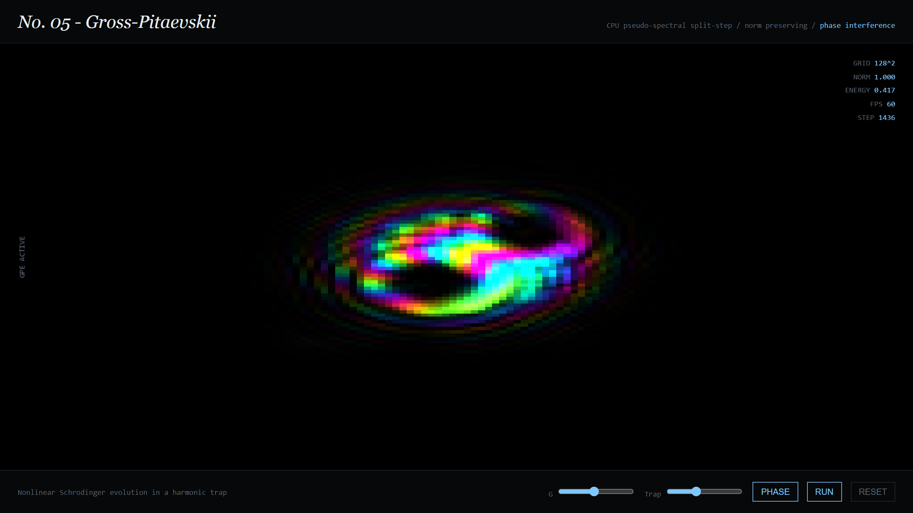

### The Experiment

Stir a normal fluid and you get a vortex of whatever strength you stirred with.
Stir a **superfluid** and you cannot: circulation is quantised. Below the critical
temperature the condensate is described by a single complex wavefunction, and
because that wavefunction has to remain single-valued, the phase can only wind by
whole multiples of 2π around any loop. Rotate the container faster and you do not
get a stronger vortex — you get *more* vortices, each carrying exactly one
quantum, arranging themselves into a lattice.

Colour encodes phase and brightness encodes density, so each visible knot is a
vortex core — the one place the density has to fall to exactly zero, because
phase is undefined there.

### Two Solvers

The build compares two mathematical paths to the same physics:

- **v001 — Time-Dependent Ginzburg-Landau**, a dissipative relaxation toward the ordered state. Cheaper, and well suited to watching defects anneal out of an initially disordered field.
- **v002 — Gross-Pitaevskii**, integrated with a pseudo-spectral split-step method that conserves norm exactly. Non-dissipative, so vortices genuinely orbit one another rather than merely settling — the version shown above.

Both run against 32-bit float state, because the vortex core is precisely where a
half-precision buffer would round the density to something other than zero and
quietly erase the defect the whole simulation exists to show.

### Live Experiment

    <a href="https://cyberhirsch.github.io/Experiments/05_Superfluid/Superfluid.html" class="inline-flex items-center px-8 py-4 text-lg font-bold text-white transition-all bg-primary-600 rounded-lg hover:bg-primary-500 hover:scale-105 shadow-xl shadow-primary-900/20">
        Launch Superfluid &nbsp; &rarr;
    </a>

*(Both the TDGL and GPE versions are offered from the launch page.)*

[View the Experiments collection &rarr;](https://github.com/cyberhirsch/Experiments)
