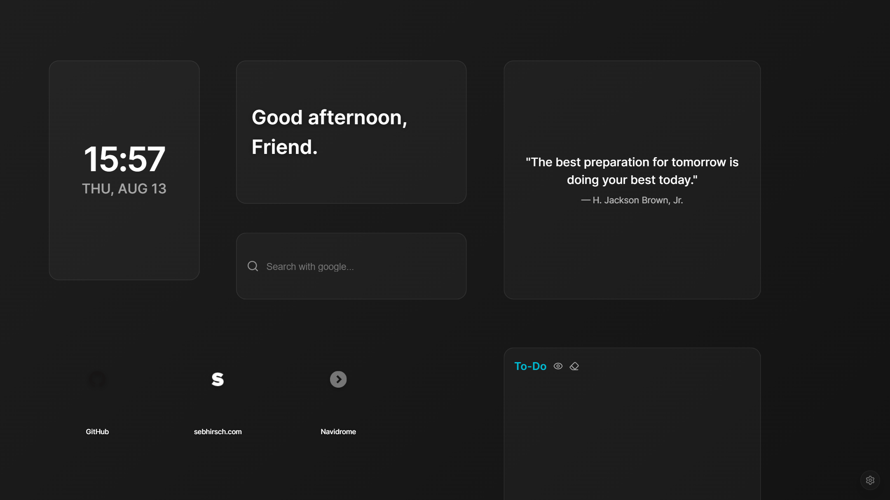

### The Project

**Tabtop** replaces the default new-tab page with a personalized dashboard: a glassmorphism-styled, real-time-synced grid layout for organizing bookmarks, widgets, and whatever else belongs on the first screen you see.

Widgets are backed by a PocketBase collection rather than local storage, so the layout — clock, greeting, quote, search bar, links, and a to-do list in the screenshot above — persists and stays in sync across devices. Widget positions are placed on a fine 64-column grid, giving pixel-level control over the layout rather than a coarse card system.

### Live Experiment

    <a href="https://cyberhirsch.github.io/Tabtop/" class="inline-flex items-center px-8 py-4 text-lg font-bold text-white transition-all bg-primary-600 rounded-lg hover:bg-primary-500 hover:scale-105 shadow-xl shadow-primary-900/20">
        Launch Tabtop &nbsp; &rarr;
    </a>

[View source on GitHub &rarr;](https://github.com/cyberhirsch/Tabtop)
