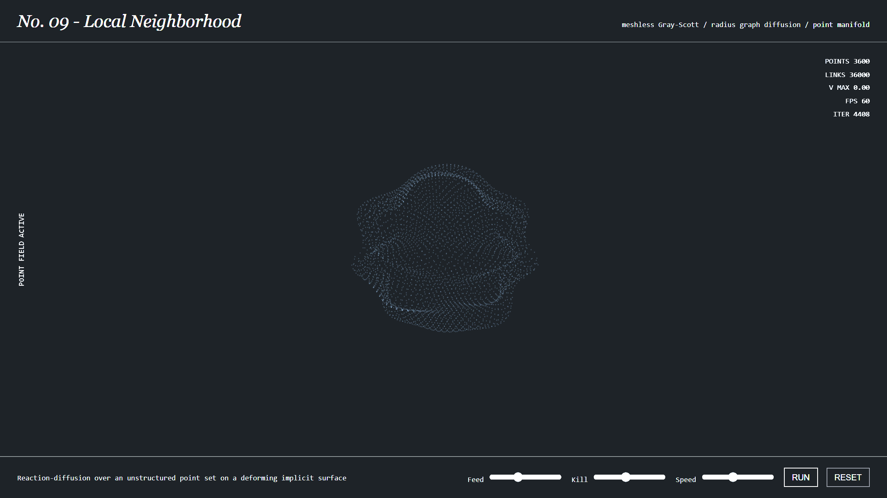

### The Experiment

Reaction-diffusion is on every generative-design syllabus, including mine, and it
is nearly always taught on a flat grid. That flat grid quietly does a lot of work,
and I wanted to find out how much by taking it away.

Turing's insight in 1952 was that two chemicals — one activating, one inhibiting,
diffusing at different rates — will spontaneously break symmetry and settle into
spots or stripes with no template telling them where to go. It remains the most
persuasive account of why animals are patterned the way they are.

The part usually left out is that real organisms are not flat. **Turing
Manifolds** runs the Gray-Scott model on a curved 3D surface to examine what
curvature does to the result.

The build above is the **v002 — Local Neighbourhood** solver: 3,600 points, each
linked to its ten nearest neighbours (36,000 links total), diffusing the
activator/inhibitor pair across that graph rather than across a fixed mesh. The
frame shown is early in a run — feed and kill rates set to their neutral
defaults, so the field is still homogeneous. Raising feed or lowering kill from
the sliders is what tips the system into symmetry-breaking and produces the
spots or stripes.

### Why Curvature Matters

Pattern formation has a characteristic wavelength set by the diffusion rates. On
a curved surface that wavelength meets a geometry that will not accommodate it
uniformly: a narrow region may admit only a few stripe periods, while a broad one
admits many, and the pattern is forced to adapt exactly where the geometry does —
which is the mechanism behind why a tapering tail and a broad flank carry
differently-scaled markings on the same animal.

- **v001 — FEM** on a fixed triangle mesh: accurate diffusion, but the result inherits any irregularity in the tessellation.
- **v002 — Meshless local-neighbourhood diffusion** on an unstructured point set, shown here: no tessellation to bias the outcome, at the cost of a more delicate operator.

### Live Experiment

    <a href="https://cyberhirsch.github.io/Experiments/09_Turing%20Manifolds/TuringManifolds.html" class="inline-flex items-center px-8 py-4 text-lg font-bold text-white transition-all bg-primary-600 rounded-lg hover:bg-primary-500 hover:scale-105 shadow-xl shadow-primary-900/20">
        Launch Turing Manifolds &nbsp; &rarr;
    </a>

*(Both the FEM and local-neighbourhood versions are offered from the launch page.)*

[View the Experiments collection &rarr;](https://github.com/cyberhirsch/Experiments)
