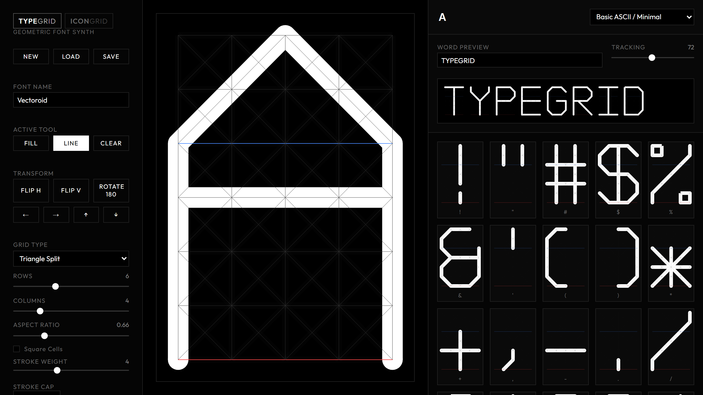

### The Premise

Modular type design has a long and slightly stubborn lineage — Crouwel's *New
Alphabet*, the Bauhaus experiments, Fontstruct's building blocks. The recurring
idea is that a typeface can be a **system** rather than twenty-six drawings: fix
the grid, fix the rules, and the letters follow.

The recurring problem is that most tools built on this idea still make you draw
letters one at a time. **TypeGrid** treats the alphabet the way a modular synth
treats a patch. You are not editing a glyph; you are editing the system that
produces all of them, and the entire A–Z inventory updates live as you move a
slider.

### Four Grid Systems

The grid is not a single geometry but a switchable one, and each produces a
distinctly different alphabet from identical segment choices:

- **Geometric (rectangular)** — the classic modular grid.
- **Curvature** — overlapping circular arcs, giving calligraphic and fluid forms.
- **Triangle split** — diagonal subdivisions, for faceted construction.
- **Hexagonal** — honeycomb modularity.

Two drawing modes sit on top: a **fill** tool that toggles solid area segments,
and a **line** tool that toggles strokes along grid lines with adjustable weight.
Skeletal and solid construction from the same underlying grid.

The control I find most instructive is the global **aspect ratio**: it fluidly
rescales the workspace and every character preview at once. Watching a condensed
alphabet become an extended one without a single glyph being redrawn is a fairly
direct demonstration of what "systematic" actually buys you.

### It Exports a Real Font

This is the part that matters, and the part that separates a sketch from a tool.
Alongside per-glyph SVG export, TypeGrid generates a working **TrueType file**
via a custom `opentype.js` wrapper that translates the SVG paths and lines into
TrueType outlines. The output installs and sets in any design application.

An experiment that cannot leave the browser is a demo. One that hands you a
`.ttf` is an instrument.

### Technical Notes

Rendered entirely in SVG, no canvas. Project state is serialised to
`localStorage`. The whole thing runs as a **standalone HTML file** — no build
step, no local server, no dependencies to install. That constraint is
deliberate: a teaching tool that requires a toolchain to open is a teaching tool
students will not open.

### Lineage

Directly indebted to **Grid Type** by Katharina Nejdl and **Fontstruct** by Rob
Meek. TypeGrid's contribution is the switchable grid geometry, the live full-
alphabet inventory, and the fact that it terminates in a real font file.

    <a href="https://cyberhirsch.github.io/TypeGrid/" class="inline-flex items-center px-8 py-4 text-lg font-bold text-white transition-all bg-primary-600 rounded-lg hover:bg-primary-500 hover:scale-105 shadow-xl shadow-primary-900/20">
        Launch TypeGrid &nbsp; &rarr;
    </a>

[View source on GitHub &rarr;](https://github.com/cyberhirsch/TypeGrid)
