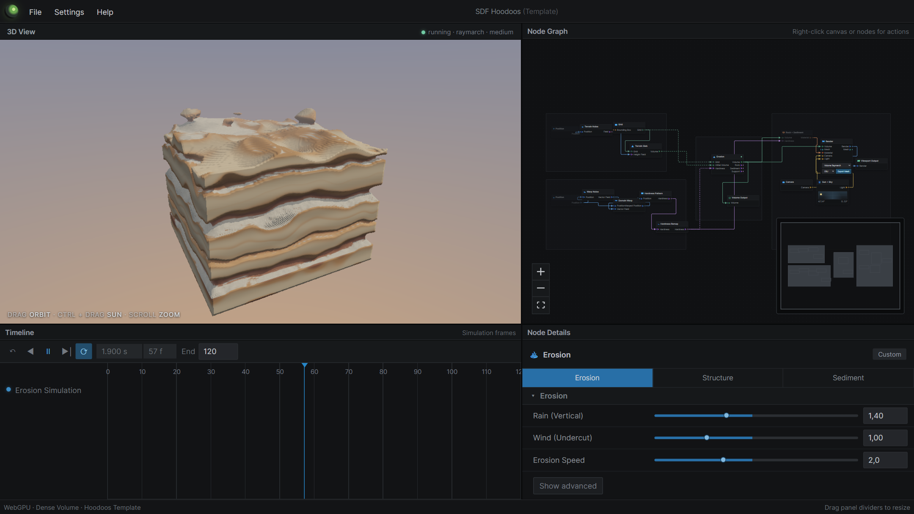

### The Project

**Voxelbox** is a node-based editor for sculpting voxel terrain by weathering it.
Terrain noise, domain warping, hardness patterns, the erosion solver and the
renderer are each nodes on a graph; the resulting dense volume is simulated and
raymarched live on the GPU through **WebGPU**, in a browser tab.

The screenshot is the built-in *Hoodoos* template partway through: rain and wind
parameters undercutting a layered sedimentary slab over 120 frames, exposing
harder strata as the softer material goes. Erosion, structure and sediment are
parameterised separately, and the timeline **scrubs the simulation** rather than
replaying a bake — stepping backwards pauses and replays from frame zero, because
an erosion process is not reversible and pretending otherwise would be a lie in
the interface.

### Why a Node Graph

Procedural terrain tools generally offer you a stack of sliders. That is fine
until you want to ask a question the stack's author did not anticipate — *what if
the hardness field is driven by warped Worley noise instead of layers?* — at which
point you are out of luck.

A graph makes the pipeline itself editable. Scalar Noise and Vector Field Noise
each offer Value, Perlin, Simplex and Worley. The Simulation Grid owns resolution
and open sides, and can take its bounds from an imported mesh's bounding box. The
Render node offers four completely different views of the same volume — Volume
Raymarch, Surface Nets, Marching Tetrahedra, and Block Voxels — with real
depth-tested raster previews that refresh from the evolving volume about once a
second.

Nodes not on the compiled active branch render dimmed with a dashed border,
because they genuinely have no effect on the simulation, and an interface that
hides that is inviting you to debug a node that was never running. Incompatible
connections name the two port types rather than failing silently.

### It Gets Out of the Browser

An experiment that cannot export is a screenshot generator. Voxelbox reads and
writes real formats in both directions:

- **Mesh import:** OBJ, FBX, glTF/GLB 2.0, USD/USDA/USDC/USDZ.
- **Voxel import:** MagicaVoxel VOX, BINVOX, and its own raw `.vxbvox`.
- **Export:** OBJ, binary STL, embedded glTF 2.0, GLB, static FBX 7.4 ASCII, USDA,
  USDZ, VOX, BINVOX, VXBVOX — generated locally from the live volume, at an export
  resolution independent of the simulation grid.

Raymarch exports are converted to Surface Nets on the way out, because a raymarch
has no triangles of its own. Chrome and Edge get native file pickers through the
File System Access API; other browsers fall back to inputs and downloads.

Projects save as portable `.vxbx` files — versioned JSON validated with Zod,
carrying graph, parameters, layout and timeline. Undo/redo covers parameter
changes, wiring, node lifecycle and grouping; simulation time is deliberately
*not* in the undo history.

### Architecture, Briefly

The thing I am most pleased with is not visible in the interface. The central
registry only aggregates node packages — each node owns its own schema, defaults,
and where relevant its GPU resources and algorithms. Erosion owns its compute
pipelines, bind groups, support pass and talus solver. Render owns raymarch and
raster pipelines, mesh extraction, readback and export. `compileGraph` walks the
active branch and produces a flat kernel parameter block; the runtime coordinates
node runtimes but contains none of their solvers.

The result is that no React component contains WebGPU code, and a future sparse
grid backend can replace dense textures without rewriting Erosion or Render. All
WGSL lives in checked-in shader files, and a CPU port of the support-flood and
talus kernels serves as an executable specification in the test suite.

The Simulation Grid exposes a deterministic **seed** — seed 0 reproduces the
reference prototype exactly.

*Private repository. Requires a WebGPU-capable desktop browser and a GPU with
enough memory — the 320³–512³ presets will exceed some devices.*
