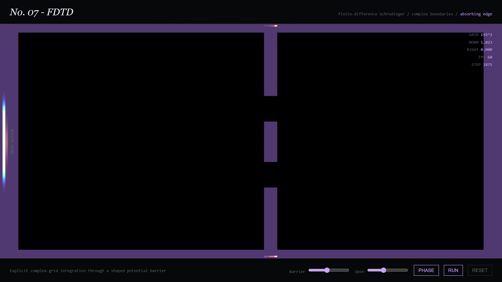

### The Experiment

Quantum tunnelling is usually taught as an assertion: a particle can be found on
the far side of a barrier it did not have the energy to cross. Stated that way it
sounds like a violation. Watched as an evolving wave packet it stops being
mysterious — the packet reaches the barrier, most of it reflects, and a small
amplitude leaks through and continues on the other side, because the wavefunction
does not stop at the barrier, it decays inside it.

The colour bar on the left is the packet at the moment of emission, phase mapped
to hue; the dark field is the propagation domain, bounded by an absorbing edge so
reflections off the domain walls don't contaminate the result. The three purple
columns are the potential barrier — narrow enough that a slice of amplitude
tunnels through even where classically nothing should pass.

### Two Solvers

- **v001 — Split-Step Fourier**, alternating between position space, where the potential term is a simple multiplication, and momentum space, where the kinetic term is. Spectrally accurate, but inherently periodic — it suits free propagation and periodic potentials.
- **v002 — Finite-Difference Time-Domain**, a direct grid stencil shown above. Slower and more diffusive, but it accepts the hard, arbitrary boundary a barrier experiment actually needs.

The `RIGHT` readout tracks the probability that has crossed to the far side — the
one number that turns "watch it tunnel" into an actual measurement.

### Live Experiment

    <a href="https://cyberhirsch.github.io/Experiments/07_Wave%20Collapse/v002_FDTD/WaveCollapse_FDTD_v002.html" class="inline-flex items-center px-8 py-4 text-lg font-bold text-white transition-all bg-primary-600 rounded-lg hover:bg-primary-500 hover:scale-105 shadow-xl shadow-primary-900/20">
        Launch Wave Collapse (FDTD) &nbsp; &rarr;
    </a>

[Or the Split-Step Fourier version &rarr;](https://cyberhirsch.github.io/Experiments/07_Wave%20Collapse/v001_SSFM/WaveCollapse_SSFM_v001.html)

[View the Experiments collection &rarr;](https://github.com/cyberhirsch/Experiments)
